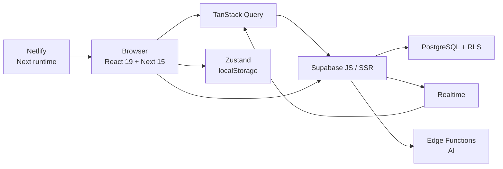

# Стек dashboard-crm

**Дата:** 2026-07-18  
**Источник:** ревью по `package.json`, `netlify.toml`, `tsconfig.json`, crm-architect `architecture.md`, live tree  

Кратко: **Next.js 15 (App Router) + React 19 + TypeScript strict + Tailwind CSS 3**, бэкенд и auth — **Supabase (PostgreSQL + RLS + Realtime)**, хостинг — **Netlify**, данные на клиенте — **TanStack Query + Zustand**, формы — **React Hook Form + Zod**.

---

## 1. Ядро приложения (frontend)

| Слой | Технология | Версии / детали |
|------|------------|-----------------|
| Framework | **Next.js** (App Router) | `^15.1.0` |
| UI runtime | **React** + **React DOM** | `^19.0.0` |
| Язык | **TypeScript** strict | `^5.7.0`, `strict: true`, path alias `@/*` → `src/*` |
| Стили | **Tailwind CSS 3** + PostCSS + Autoprefixer | `^3.4.16` |
| Иконки | **lucide-react** | |
| Шрифты | **geist** + несколько семейств в root layout (Manrope, IBM Plex, Onest и др.) | 6 визуальных тем через CSS variables (`t-aura`, `t-fuji`, …) |
| Утилиты className | `clsx` + `tailwind-merge` | |
| Toasts | **sonner** | |
| Графики | **Recharts** | analytics / overview |
| DnD | **@dnd-kit** (core, sortable, utilities) | канбан-доски задач/колонок |
| Excel | **xlsx** | импорт компаний |
| Даты | **date-fns** + **date-fns-tz** | плюс свои `date-helpers` (MSK / Gantt-бакеты) |

**Архитектурный стиль UI:** почти весь дашборд — **client-heavy SPA внутри App Router** (хуки + React Query). UI-примитивы **кастомные**, не shadcn/Radix: свой `Modal`, combobox, chips, sidebar.

Структура: `src/app/(dashboard)/…` — маршруты; `src/components/*` — фичи; `src/lib/hooks`, `stores`, `validators`, `supabase`.

---

## 2. Данные, auth, backend

| Слой | Технология | Роль |
|------|------------|------|
| BaaS / DB | **Supabase** | PostgreSQL, Auth, Storage, Realtime, Edge Functions |
| JS SDK | `@supabase/supabase-js` `^2.47` | browser client |
| SSR cookies | `@supabase/ssr` `^0.5` | server client + middleware session |
| Безопасность данных | **Row Level Security (RLS)** | multi-tenant `org_id`, роли `owner/admin/manager/viewer` |
| Схема | SQL-миграции в `supabase/migrations/` | нумерованные 0xx + baseline; **apply не из CLI push**, а через гейт (MCP/Cowork) |
| Типы БД | codegen (`supabase gen types`) | `src/types/supabase.gen.ts` / `database.ts` |
| Realtime | Supabase Realtime → invalidate React Query | `use-realtime` |
| Edge Functions | Deno-функции в `supabase/functions/` | например `ai-run`, `ai-summarize` (AI Hub) |

Клиентский доступ к данным в основном **напрямую из браузера в Supabase** (с RLS), а не через классический Nest/Express API. Server Actions / API routes есть точечно (auth shell, AI), но «источник правды» — Postgres + policies.

---

## 3. Состояние и формы

| Задача | Стек |
|--------|------|
| Серверное/кэш состояние | **TanStack React Query v5** (`useQuery` / `useMutation`, optimistic updates) |
| Локальный UI / тема | **Zustand** + `persist` (localStorage, например `dashboard-theme`) |
| Формы | **React Hook Form** + **@hookform/resolvers** |
| Валидация | **Zod** (`src/lib/validators/*`) |
| URL-фильтры | свои хуки (`use-chip-filter` и т.п., `router.replace`) |

Паттерн мутаций: cancel → snapshot → optimistic → rollback on error → invalidate on settled.

---

## 4. Хостинг и runtime

| Слой | Технология |
|------|------------|
| Host | **Netlify** (`netlify.toml`) |
| Next adapter | `@netlify/plugin-nextjs` (SSR, middleware, не «голый» static `.next`) |
| Node | **20** (build env) |
| Security headers | HSTS, X-Frame-Options, CSP-lite и т.д. в `netlify.toml` |

Не Vercel как primary host (хотя Next.js тот же).

---

## 5. Качество и DX

| Задача | Стек |
|--------|------|
| Unit / component tests | **Vitest** + Testing Library + jsdom |
| E2E | **Playwright** |
| Lint | **ESLint 9** + `eslint-config-next` |
| Build | `next build` |

---

## 6. Чего в стеке **нет** (важно для картины)

- **Не** shadcn/ui / Radix UI как база компонентов  
- **Не** Prisma / Drizzle как ORM (SQL + Supabase client)  
- **Не** tRPC / GraphQL  
- **Не** Redux  
- **Не** Material UI / Ant Design  
- Gantt — **свой CSS-grid**, без dhtmlx/frappe-gantt  
- AI — через **Supabase Edge Functions**, не через Vercel AI SDK в `package.json`

---

## 7. Схема «как это склеивается»

---

## 8. Одной фразой

**SaaS CRM на Next.js 15 / React 19 / TypeScript / Tailwind, multi-tenant Postgres в Supabase с жёстким RLS, клиентским React Query и деплоем на Netlify** — с кастомным design system (6 тем), delivery/Gantt/WBS и AI-обвязкой через Edge Functions.

---

## 9. Ключевые пути в репо

| Что | Где |
|-----|-----|
| Зависимости | `package.json` |
| Деплой | `netlify.toml` |
| Миграции | `supabase/migrations/` |
| Edge Functions | `supabase/functions/` |
| Supabase clients | `src/lib/supabase/client.ts`, `server.ts` |
| Хуки данных | `src/lib/hooks/` |
| Валидаторы форм | `src/lib/validators/` |
| Темы / CSS tokens | `src/app/globals.css`, `src/lib/stores/theme-store.ts` |
| Архитектурный справочник | `~/.claude/skills/crm-architect/references/architecture.md` |
