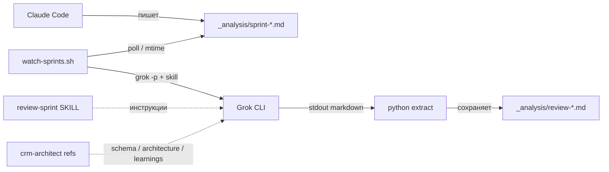

# Автоматическое ревью спринтов — как это устроено

**Дата:** 2026-07-16  
**Проект:** dashboard-crm  
**Задача:** как только Claude Code кладёт новый sprint/handoff `.md` в `_analysis/`, автоматически делать code-review и сохранять `_analysis/review-<имя>.md`.

---

## 1. Исходная задача

Ты описал желаемый pipeline:

```
Claude Code пишет спринт
        ↓
появляется _analysis/sprint-*.md (или handoff-*.md)
        ↓
Grok проверяет по живому коду + crm-architect
        ↓
появляется _analysis/review-<то же имя>.md
```

В проекте такой паттерн **уже был ручным**: например `sprint-rename-deals.md` → `review-sprint-rename-deals.md` (ревью от 2026-07-10). Нужно было сделать его **повторяемым и автоматическим**.

---

## 2. Принцип решения: три слоя

Автоматизация разбита на три независимые части. Каждая отвечает на свой вопрос:

| Слой | Вопрос | Что это |
|------|--------|---------|
| **Конвенция имён** | Куда смотреть и куда писать? | `sprint-foo.md` → `review-sprint-foo.md` |
| **Скилл `review-sprint`** | *Как* ревьюить? | Промпт-инструкция для агента: чеклист, формат, источники правды |
| **Watcher-скрипт** | *Когда* ревьюить? | Bash-цикл: находит «непроверенные» файлы → вызывает `grok` CLI |



**Ключевая идея:** скилл не «магия Cursor» — это **контракт качества ревью**. Watcher — тонкий оркестратор, который не знает деталей ревью, только вызывает агента с правильным промптом.

---

## 3. Пошагово: что было сделано

### Шаг 1 — Изучил существующий workflow

- Спринты лежат в `_analysis/sprint-*.md` и `_analysis/handoff-*.md`.
- Ревью — в `_analysis/review-<basename>.md` (тот же basename, префикс `review-`).
- Качественные примеры: `review-sprint-rename-deals.md`, `review-sprint-delivery-p2b.md`.
- Чеклист качества спринтов уже есть в скилле `crm-architect` (РАЗВЕДКА, schema truth, RLS, и т.д.).

**Вывод:** не изобретать новый формат ревью — **кодифицировать существующий** в отдельном скилле.

---

### Шаг 2 — Создал скилл `review-sprint`

**Путь:** `.grok/skills/review-sprint/SKILL.md`

Скилл фиксирует:

1. **Вход:** `sprint-*.md`, `handoff-*.md`
2. **Выход:** `review-<basename>.md`
3. **Обязательные чтения:** sprint + `crm-architect/references/{schema,architecture,learnings}.md`
4. **Workflow верификации:** РАЗВЕДКА → schema → grep файлов → scope → чеклист → вердикт
5. **Формат документа:** вердикт-таблица, **балл 0–100** (порог **≥ 85** → GO в Claude Code; B* → max 84), блокеры B*, предупреждения W*, «можно в CC?»
6. **Два режима вывода:**
   - интерактивный (агент пишет файл tool-ом);
   - headless CLI (агент печатает markdown в stdout — см. шаг 4).

Копия скилла: `_analysis/auto-sprint-review-artifacts/skills/review-sprint/SKILL.md`

---

### Шаг 3 — Скрипт обнаружения кандидатов

**Путь:** `.grok/skills/review-sprint/scripts/list-pending.sh`

Логика простая:

```bash
для каждого _analysis/sprint-*.md и handoff-*.md:
  если нет review-<имя>.md          → NEW (нужно ревью)
  если спринт новее review (mtime)  → STALE (пере-ревью)
```

Это **детерминированный триггер** — не inotify, не git hook. Достаточно для задачи «появился файл».

---

### Шаг 4 — Скрипт ревью `watch-sprints.sh`

**Путь:** `.grok/skills/review-sprint/scripts/watch-sprints.sh`

Цикл работы одного прохода (`scan_and_review`):

1. **Lock** — `review.lock.d/` (mkdir), чтобы два процесса не ревьюили параллельно.
2. **find_candidates** — список NEW/STALE из шага 3.
3. **review_file** для каждого кандидата (по умолчанию 1 за проход):
   - собирает промпт: «загрузи skill review-sprint, проверь `<path>`»;
   - вызывает `grok --cwd <repo> --permission-mode dontAsk --max-turns 30 -p "<prompt>"`;
   - stdout → `review.raw.md`;
   - **python extract** — вырезает markdown с первого `# Ревью:` / `# Review:` (см. ниже);
   - `mv` → `_analysis/review-<basename>.md`;
   - пишет в `watcher.log`.

**Режимы:**

| Флаг | Поведение |
|------|-----------|
| `--once` | один проход по всей очереди (или `--batch-size N`) |
| `--batch-size 1` | максимум 1 спринт за проход |
| без флагов | бесконечный poll + `--interval` сек |

---

### Шаг 5 — Разгадка grok CLI (важный подводный камень)

Первая версия предполагала: `grok -p` с `--permission-mode acceptEdits` **сам запишет файл**. **Не работает.**

| Попытка | Результат |
|---------|-----------|
| `grok -p` + «write file» | Агент *говорит*, что записал; файл на диске **не появляется** |
| Проверка stdout | Ревью **есть**, но с преамбулой: `I'll load...# Ревью: ...` **на одной строке** |
| `awk '/^# Ревью/'` | Падает — заголовок не в начале строки |
| **python `re.search(r'# (?:Ревью|Review):')`** | Работает — вырезает с первого заголовка |

**Итоговый контракт headless-режима** (прописан в скилле):

- агент **не пишет файлы** tool-ами;
- агент **печатает полный review markdown в stdout**;
- bash сохраняет stdout в `_analysis/review-*.md`.

Также: `--max-turns 30` — сложные спринты (RBAC, RLS) требуют много grep/read; без этого обрывается на преамбуле.

---

### Шаг 6 — Фоновый watcher (автозапуск)

**Проблема:** агент в чате Cursor **не видит** файловую систему, пока ты с ним не говоришь. Нужен **отдельный долгоживущий процесс**.

**Путь:** `~/.grok/bin/start-sprint-watcher-tmux.sh` (имя историческое, tmux не обязателен)

```bash
nohup bash -c '
  while true; do
    watch-sprints.sh --once --batch-size 1 || true
    sleep 120    # пауза между спринтами
  done
' >> .grok/sprint-review-watcher/watcher.log &
```

**Управление:** `.grok/skills/review-sprint/scripts/manage-watcher.sh`

```bash
./.grok/skills/review-sprint/scripts/manage-watcher.sh status
./.grok/skills/review-sprint/scripts/manage-watcher.sh start
./.grok/skills/review-sprint/scripts/manage-watcher.sh stop
./.grok/skills/review-sprint/scripts/manage-watcher.sh once 3   # разово 3 штуки
```

---

### Шаг 7 — launchd (не сработал для ~/Downloads)

Пробовал `LaunchAgent` для автозапуска при логине.

**Файл:** `~/Library/LaunchAgents/com.dashboard-crm.sprint-review-watcher.plist`  
Копия: `_analysis/auto-sprint-review-artifacts/launchd/com.dashboard-crm.sprint-review-watcher.plist`

**Ошибка macOS TCC:**

```
Operation not permitted
.../Downloads/dashboard-crm/.grok/skills/.../watch-sprints.sh
```

Фоновые агенты launchd **не имеют доступа к `~/Downloads`** без Full Disk Access. Поэтому рабочий вариант — **nohup-процесс**, запущенный из терминала (у терминала доступ к Downloads есть).

**Если нужен launchd:** System Settings → Privacy → Full Disk Access → добавить `/bin/bash`, затем `launchctl bootstrap gui/$UID ~/Library/LaunchAgents/com.dashboard-crm.sprint-review-watcher.plist`.

Сейчас plist **выгружен**; используется nohup-watcher.

---

## 4. Карта файлов

```
dashboard-crm/
├── .grok/
│   ├── skills/review-sprint/
│   │   ├── SKILL.md                          ← контракт ревью
│   │   └── scripts/
│   │       ├── watch-sprints.sh              ← ядро: poll + grok + save
│   │       ├── list-pending.sh               ← список NEW/STALE
│   │       └── manage-watcher.sh             ← start/stop/status
│   └── sprint-review-watcher/
│       ├── watcher.log                       ← лог прогона
│       ├── watcher.pid                       ← pid фонового процесса
│       └── review.lock.d/                    ← lock (время работы)
├── _analysis/
│   ├── sprint-*.md                           ← вход
│   ├── handoff-*.md                          ← вход
│   └── review-*.md                           ← выход
└── _analysis/auto-sprint-review-artifacts/   ← копии для документации

~/.grok/bin/
├── grok                                      ← CLI агента
├── sprint-review-watcher                     ← wrapper (DASHBOARD_CRM_ROOT)
└── start-sprint-watcher-tmux.sh              ← nohup-стартер

~/Library/LaunchAgents/
└── com.dashboard-crm.sprint-review-watcher.plist  ← опционально, сейчас off
```

---

## 5. Конвенция имён (триггер автоматизации)

| Вход | Выход |
|------|-------|
| `_analysis/sprint-delivery-p2b.md` | `_analysis/review-sprint-delivery-p2b.md` |
| `_analysis/handoff-gantt-v0.md` | `_analysis/review-handoff-gantt-v0.md` |

Правило в коде:

```bash
review="${REPO_ROOT}/_analysis/review-$(basename "${sprint}")"
```

Пере-ревью: если `sprint.mtime > review.mtime` → кандидат снова.

---

## 6. Что проверяет ревью (содержательно)

Скилл наследует **crm-architect Sprint Prompt Quality Checklist**:

- РАЗВЕДКА перед правками
- реальные имена таблиц/колонок из `schema.md`
- реальные пути из `architecture.md`
- gotchas из `learnings.md`
- RLS/org_id/`current_org_role()`
- миграции не apply из CC
- и вердикт: **можно отдавать в Claude Code / только после правок**

Формат выхода совпадает с ручными ревью (вердикт-таблица, блокеры, пропущенные grep-места).

---

## 7. Ограничения и operational notes

| Тема | Деталь |
|------|--------|
| Скорость | ~1–3 мин на спринт + пауза 120 с; очередь из 35+ файлов = часы |
| Зависание | Длинный grok-процесс иногда висит 30–50 мин → `manage-watcher.sh stop && start` |
| Параллельность | Lock запрещает два ревью одновременно; не запускай несколько `--once` |
| API | Каждое ревью = вызов grok CLI (сеть, квота) |
| После reboot Mac | Нужно снова: `~/.grok/bin/start-sprint-watcher-tmux.sh` |
| Ручной режим | В чате: «проверь `_analysis/sprint-foo.md`» или `/review-sprint` |

---

## 8. Быстрый старт

```bash
# 1. Проверить очередь
./.grok/skills/review-sprint/scripts/manage-watcher.sh status

# 2. Запустить фоновый watcher
~/.grok/bin/start-sprint-watcher-tmux.sh

# 3. Смотреть прогресс
tail -f .grok/sprint-review-watcher/watcher.log

# 4. Разово прогнать один спринт
./.grok/skills/review-sprint/scripts/manage-watcher.sh once 1
```

---

## 9. Как повторить в другом проекте

1. Завести конвенцию `prompt-*.md` → `review-*.md`.
2. Написать скилл с форматом ревью и ссылками на «источники правды» проекта.
3. Bash-скрипт: glob + mtime + `grok -p` + extract stdout.
4. Фоновый nohup-цикл (или launchd, если проект **не** в `~/Downloads`).
5. Обязательно протестировать: **grok -p не пишет файлы** — только stdout.

---

## 10. Артефакты (копии в репозитории)

Все файлы решения продублированы в:

```
_analysis/auto-sprint-review-artifacts/
├── README.md
├── skills/review-sprint/SKILL.md
├── scripts/
│   ├── watch-sprints.sh
│   ├── list-pending.sh
│   └── manage-watcher.sh
├── bin/
│   ├── sprint-review-watcher
│   └── start-sprint-watcher-tmux.sh
└── launchd/
    └── com.dashboard-crm.sprint-review-watcher.plist
```

Живые (рабочие) копии — в `.grok/skills/` и `~/.grok/bin/` как в карте выше.