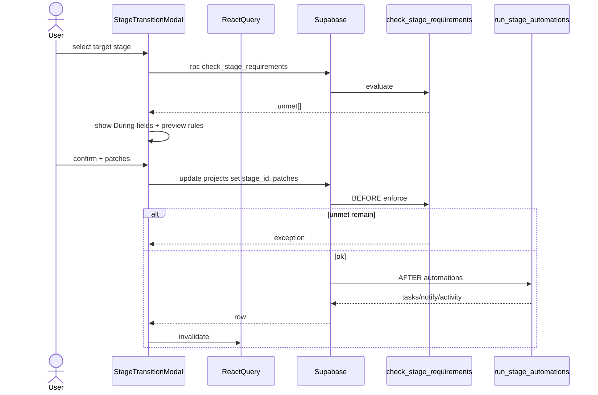
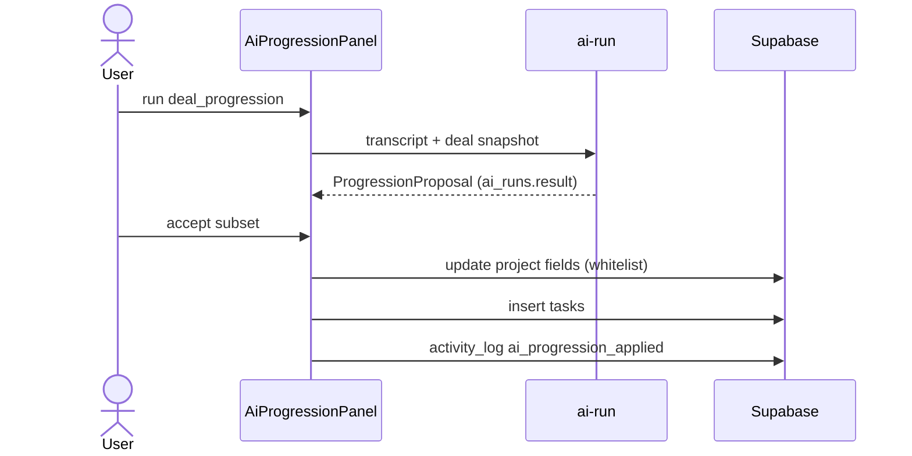
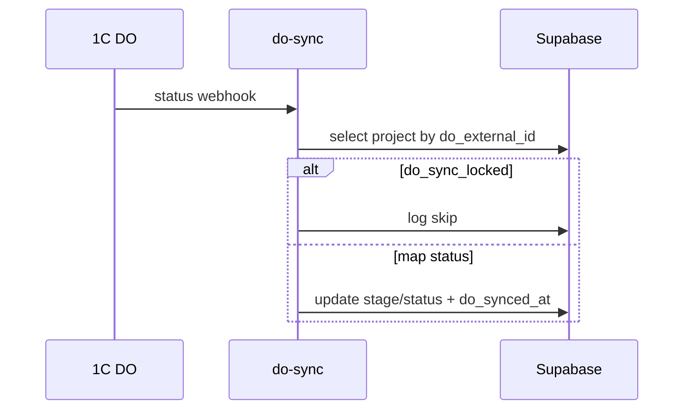

# Roadmap #2 — детальная архитектура (P0–P4)

**Дата:** 2026-07-26  
**Статус:** draft for architecture review (Claude / senior engineer)  
**Продуктовый источник:** [`CRM-ROADMAP-2.md`](CRM-ROADMAP-2.md)  
**Стек:** Next.js 15 · TypeScript · TanStack Query · Supabase (Postgres + RLS + Edge Functions) · Vercel  
**Репозиторий:** `godfathxrpe/dashboard-crm`  
**Не цель документа:** sprint prompts, UI-макеты, copy.  
**Цель:** контракты данных, границы модулей, потоки, RLS, эволюция без ломки AS-IS.

---

## 0. Review brief (для Claude)

Просьба к ревьюеру:

1. Проверить **консистентность** с живой моделью (`projects` collapsed, S27 gates, `050`/`051` workflow, AI Hub HITL).  
2. Найти **over/under-engineering** в segments predicate engine, RI score, DO sync, webhooks.  
3. Проверить **RLS / multi-tenant** (org-first, `current_org_id()`, `current_org_role()`, ownership).  
4. Оценить **порядок миграций** и обратимость.  
5. Указать **missing invariants**, race conditions, идемпотентность, failure modes.  
6. Предложить упрощения, если фаза раздута.

**Инварианты продукта (не ломать):**

| # | Инвариант |
|---|-----------|
| I1 | Одна таблица `projects` с `type ∈ {client, delivery, internal}` — **не** разносить deals/projects |
| I2 | Stage gates enforcement **в БД** (`check_stage_requirements` + BEFORE trigger) — UI только guided layer |
| I3 | Delivery SoR документов = **1С:ДО**; CRM = coordination mirror (`do_url`, позже read-only status) |
| I4 | AI = **HITL only** — write-back только после confirm пользователя |
| I5 | Automation **никогда** не блокирует UPDATE (EXCEPTION-swallow); gate — блокирует |
| I6 | Нет email 2-way, dialer, PSA time/billing, client portal в R2 |
| I7 | `set_field` automation whitelist: `next_step \| pinned_note \| next_action_date \| probability` — **не** `stage_id/status/type/org_id` |
| I8 | Auto-spawn delivery **без HITL** запрещён (РП выбирает kind) |

---

## 1. AS-IS foundation (что уже есть)

### 1.1 Объектная модель (ядро)

```
organizations
  └── memberships (owner|admin|manager|viewer)
  └── projects
        type=client     → /deals          (воронка, gates, quotes, next_step)
        type=delivery   → /projects       (parent_deal_id, phases СДР, Gantt, team)
        type=internal   → /projects       (kanban, без воронки)
  └── tasks (project_id?, Gantt dates, WBS, deps, recurring)
  └── contacts / companies / calls / meetings / leads
  └── quotes (→ client projects)
  └── automation_rules / automation_runs
  └── stage_requirements
  └── notifications / activity_log
  └── transcripts / ai_runs
  └── project_files / project_messages / project_videos / project_baselines
```

### 1.2 Уже реализованные подсистемы (не перепроектировать)

| Подсистема | Ключевые артефакты | Роль в R2 |
|------------|-------------------|-----------|
| Blueprint v1 | `stage_requirements`, `check_stage_requirements`, `useStageGate`, `StageReadiness` | **P0** = UX layer поверх |
| Workflow Engine | `050` `run_stage_automations`, `051` `task_overdue`, Settings UI | **P0/P2** = breadth |
| Deal health / aging | `deal-health.ts` (`getDealHealth`, `getStageAging`) | **P1** = dwell thresholds config |
| Delivery health / portfolio | `delivery-health.ts`, `usePortfolioHealth`, `PortfolioView` | stable |
| Win handoff | `SpawnWizard`, `spawn_delivery_project`, `DealDeliveryHub` | polish only |
| Gantt stack | dates, deps FS/SS/FF/SF, cascade, CPM, baselines | stable |
| AI Hub | `ai-run` edge, presets, `AiWorkspaceModal`, S28 summary | **P0** = progression write-back |
| Saved views | `use-saved-views` **localStorage only** | **P0** = server segments |
| Reconnect | `use-last-touch`, `RECONNECT_THRESHOLD_DAYS` constant | **P0** = org config |
| Delivery completion | `check_delivery_completion`, `DeliveryCompletionModal` | **P1** = + checklists |
| user_settings | personal widgets/theme — **почти не используется app-layer** | optional reuse for triage |

### 1.3 Точки изменения stage (AS-IS entry points)

Любой guided transition должен перехватывать **все** write-path'ы `stage_id`:

| Entry point | Файл (ориентир) | Примечание |
|-------------|-----------------|------------|
| Kanban drag | `PipelineBoard.tsx` | primary sales UX |
| Chevron / strip | `StackedPipeline.tsx`, `DealProgressBar` | detail page |
| Project modal / forms | `ProjectModal.tsx` | secondary |
| Automation `set_field` | **запрещён** для stage_id | I7 |
| Future API/webhook inbound | P4 | must call same service |

**Архитектурное решение:** единый client-side service `transitionDealStage()` + единый server enforcement (уже есть). UI modal — **единственный** public path для user-initiated stage change (остальные path'ы зовут его).

### 1.4 AI write-back AS-IS

Сейчас `AiWorkspaceModal.applyNextStep` пишет **только** `calls.next_step` / `meetings.next_step` — **не** deal fields.  
`AiSummary.suggested_next_step` — text only.  
R2-P0 добавляет **proposal → confirm → multi-field apply** на `projects(client)`.

### 1.5 Organizations settings AS-IS

Живая `organizations` (gen types): `id, name, created_by, created_at, updated_at` — **без** `settings`.  
`user_settings` — personal (`profile_id` PK), поля focus/widgets/theme.  
→ Org prefs: **новая колонка** `organizations.settings jsonb` (предпочтительно) или таблица `org_settings`. Рекомендация: **jsonb на organizations** (мало ключей, 1 row/org).

---

## 2. Cross-cutting architecture

### 2.1 Слои

```
┌─────────────────────────────────────────────────────────┐
│  UI (pages / components)                                 │
│  TransitionModal · SegmentsBar · AiProgressionPanel · …  │
├─────────────────────────────────────────────────────────┤
│  Domain services (client pure + hooks)                   │
│  transitionDealStage · evaluateSegment · scoreContact    │
│  buildProgressionProposal · applyProgressionPatch        │
├─────────────────────────────────────────────────────────┤
│  React Query hooks (use-*)                               │
│  cache keys, optimistic updates, invalidation            │
├─────────────────────────────────────────────────────────┤
│  Supabase client (browser) / Edge Functions              │
├─────────────────────────────────────────────────────────┤
│  Postgres: tables · RLS · triggers · RPC · pg_cron       │
└─────────────────────────────────────────────────────────┘
```

**Правило:** бизнес-инварианты enforcement (gates, completion, automation isolation) — **в Postgres**.  
**Правило:** presentation + guided UX + AI proposals — **в client/edge**.  
**Правило:** segment predicate evaluation — **client on-read v1** (см. P0 ADR), server SQL v2 only if perf fails.

### 2.2 Naming & file placement (conventions)

| Тип | Path |
|-----|------|
| Миграции | `supabase/migrations/0XX_*.sql` (следующий free после 075; **не** apply из CC) |
| Types | `src/types/database.ts` (custom) + regenerate `supabase.gen.ts` |
| Validators | `src/lib/validators/*.ts` (Zod) |
| Pure domain | `src/lib/utils/*.ts` или `src/lib/domain/*.ts` (new folder ok) |
| Hooks | `src/lib/hooks/use-*.ts` |
| UI | `src/components/{domain}/` |
| Constants | `src/lib/constants/` |
| Edge | `supabase/functions/*` |
| Docs | `docs/schema.md` **в том же PR**, что миграция |

### 2.3 RLS template (все новые org tables)

```sql
-- SELECT: member of org
USING (org_id = public.current_org_id())

-- INSERT: member + role gate (см. per-table)
WITH CHECK (org_id = public.current_org_id() AND public.current_org_role() IN (...))

-- UPDATE: same org + role; WITH CHECK org_id immutable (freeze_org_id trigger already on many tables)
-- DELETE: same

-- SECURITY DEFINER functions:
--   SET search_path = public, pg_temp
--   REVOKE ALL FROM PUBLIC, anon, authenticated
--   GRANT EXECUTE TO authenticated | service_role (addressable)
```

Ownership patterns:

- Config tables (`segments` shared, `stage_playbooks`, checklists templates): **owner/admin** write, all members read.  
- Personal overlays (`segment_prefs`, triage snooze): **profile_id = auth.uid()**.  
- Entity data (`deal_stakeholders`): manager+ write if can update parent project.

### 2.4 Query cache keys (React Query)

```
['projects'] | ['projects', id]
['segments', orgId]
['stage-playbooks', pipelineId]
['stage-gate', projectId, targetStageId]     // existing
['delivery-gate', projectId]                 // existing
['relationship-scores']                      // map contactId → score
['company-360', companyId]
['resource-load']
['webhooks']
['project-checklists', projectId]
```

Invalidation rules:

- Stage transition success → invalidate projects + stage-gate + portfolio-health + entity-timeline.  
- SDP apply → projects + calls/meetings + tasks + timeline.  
- Segment CRUD → segments only (filters applied client-side).  

### 2.5 Error & toast contract

| Layer | Behavior |
|-------|----------|
| Gate fail (DB) | Postgres exception → client maps to Russian hint list (existing StageReadiness style) |
| Transition modal validation | Client Zod before write |
| Automation fail | Silent (already swallow); optional activity_log |
| AI fail | AiRun status=error; no partial write |
| Webhook fail | Retry queue + dead letter (P2) |

### 2.6 Feature flags / phased delivery

No LaunchDarkly. Use:

1. **Migration present** = data path exists.  
2. **UI mounted** behind role or env `NEXT_PUBLIC_R2_*` only if needed.  
3. Prefer **ship dark** (tables first) then UI — segments/playbooks/checklists.

### 2.7 Non-goals (architecture-level)

- Visual workflow canvas  
- Runtime custom objects / metadata API  
- Email graph / firm-wide calendar sync  
- Timesheets / invoicing  
- Replacing `activity_log` with generic event bus  
- Moving stage enforcement to client only  

---

## 3. Phase P0 — Process feel

**Цель фазы:** guided stage transitions + shared views + AI progression HITL + org reconnect config + automation breadth (days_in_stage / spawn_suggest).  
**Оценка:** ~2.5 спринта.  
**Demo:** drag deal → modal → fields/won reason → success; after call AI proposes deal patch; colleague sees same Smart View.

### 3.0 P0 component map

```
P0
├── A. Stage Transition Service + Modal
├── B. Server Segments (Smart Views)
├── C. Smart Deal Progression (HITL)
├── D. Org settings (reconnect_days + stage_dwell defaults)
└── E. Workflow breadth v2.1 (triggers/actions incremental)
```

---

### 3.1 P0-A — Stage Transition (Blueprint v2 UX)

#### 3.1.1 Problem

DB already enforces gates. User experiences: drag → error toast / silent fail. Missing: During-inputs (Zoho), reason capture, automation preview, single path for won/lost.

#### 3.1.2 Design decision

| Option | Pros | Cons | Decision |
|--------|------|------|----------|
| **A. Client modal only** (call existing update) | Simple; reuses S27 | Can't force all entry points without discipline | **Chosen for v1** |
| B. RPC `transition_project_stage(...)` | Single server entry; audit | Duplicates gate logic; more DEFINER surface | P2 if entry-point drift |
| C. Soft gates in UI only | Fast | Breaks I2 | Rejected |

**v1:** client `transitionDealStage` + mandatory modal for interactive paths.  
**v2 (optional):** RPC wrapper for API/webhooks.

#### 3.1.3 Domain service (client)

```ts
// src/lib/domain/stage-transition.ts

export type TransitionInput = {
  projectId: string;
  fromStageId: string | null;
  toStageId: string;
  // During-inputs (merged into projects UPDATE)
  fieldPatches: Partial<Pick<Project,
    'budget' | 'company_id' | 'contact_id' | 'next_step' |
    'next_action_date' | 'deadline' | 'probability' | 'direction' |
    'pinned_note' | 'won_reason' | 'won_detail' | 'loss_reason' | 'loss_detail'
  >>;
  comment?: string;           // → activity_log note
  createTasksFromPlaybook?: boolean; // P1 playbooks; stub false in P0
};

export type TransitionPreview = {
  unmet: UnmetRequirement[];          // from useStageGate / RPC
  targetIsWon: boolean;
  targetIsLost: boolean;
  automationPreview: AutomationPreviewItem[]; // rules that WOULD match
  requiredDuringFields: GateFieldColumn[];    // unmet field gates
};

export async function previewTransition(...): Promise<TransitionPreview>
export async function commitTransition(input: TransitionInput): Promise<void>
// commit = single projects.update({ stage_id, ...fieldPatches })
//        + optional activity insert
// Gate still enforced by DB trigger — client pre-check is UX only
```

#### 3.1.4 UI components

| Component | Responsibility |
|-----------|----------------|
| `StageTransitionModal` | Modal shell: readiness list, dynamic fields, won/lost reason, comment, confirm |
| `StageTransitionFields` | Renders only **unmet field requirements** + always won/lost reason when target is_won/is_lost |
| `AutomationPreviewList` | Read-only list of matching rules (name + action summary) |
| Integration in `PipelineBoard`, `StackedPipeline`, `DealProgressBar` | Intercept stage change → open modal instead of direct mutate |

#### 3.1.5 Data flow

```
User drops card on stage B
  → open StageTransitionModal(project, toStageId)
  → parallel:
       useStageGate(projectId, toStageId)
       useAutomationRules() filter match stage_entered(B)
  → user fills During fields / reasons
  → commitTransition:
       updateProject({ id, stage_id: B, ...patches })
       optional: insert activity note
  → DB:
       trg_aa_enforce_stage_gate (BEFORE) may REJECT
       trg_zz_run_automations (AFTER) fires rules
  → invalidate caches + toast
```

#### 3.1.6 Won / Lost handling

- Target stage `is_won` → require `won_reason` (enum already exists, migration 043).  
- Target `is_lost` → require `loss_reason`.  
- Status sync: existing triggers that set `status=won/lost` from stage flags remain SoT — **do not** dual-write status in modal unless current code already does (verify PipelineBoard path; keep parity).

#### 3.1.7 Automation preview (no execution)

Client-side match only:

```
rule.trigger_type === 'stage_entered'
&& rule.trigger_config.stage_id === toStageId
&& rule.is_active
&& evalConditions(rule.conditions, projectSnapshotWithPatches)
```

Do **not** call a "dry-run" RPC in P0 (cost). Document limitation: preview may diverge if SQL condition evaluator differs — keep `wf_eval_conditions` ops mirrored in TS (`src/lib/domain/wf-conditions.ts`).

#### 3.1.8 Schema changes P0-A

**None required** if won/loss reasons already on projects.  
Optional: `activity_log` event_type `stage_transition_comment` — or reuse existing note/activity pattern.

#### 3.1.9 Risks

| Risk | Mitigation |
|------|------------|
| Missed entry point still direct-updates stage | Code search + eslint custom? or later RPC |
| Double modal on chevron+board | Single store `useTransitionStore` (zustand) |
| Gate race (two tabs) | DB remains SoT; modal re-fetch unmet on submit |

---

### 3.2 P0-B — Server Segments (Smart Views)

#### 3.2.1 Problem

`use-saved-views` stores `{id, label, route, query}` in **localStorage** — not multi-device, not multi-user, not onboarding-safe.

#### 3.2.2 Design decision: URL snapshot vs predicate AST

| Option | Pros | Cons | Decision |
|--------|------|------|----------|
| **A. URL query snapshot** (Close-like save current) | 1:1 with current filters; trivial migrate | Opaque; hard to compose notifications | Good for **personal** |
| **B. Predicate AST** (structured filters) | Shareable, composable, automation-ready | Need evaluator; field whitelist | **Chosen for org segments** |
| C. Both | Flexible | Complexity | **Chosen:** org segments = B; personal recent = A optional |

#### 3.2.3 Schema

```sql
-- migration: segments
create table public.segments (
  id            uuid primary key default gen_random_uuid(),
  org_id        uuid not null references public.organizations(id) on delete cascade,
  name          text not null,
  entity        text not null check (entity in (
                  'deals','deliveries','contacts','companies','tasks','leads'
                )),
  predicate     jsonb not null default '{}',  -- SegmentPredicate
  is_shared     boolean not null default true,
  owner_id      uuid references public.profiles(id) on delete set null,
  sort_order    int not null default 0,
  created_at    timestamptz not null default now(),
  updated_at    timestamptz not null default now(),
  unique (org_id, entity, name)
);

create index idx_segments_org_entity on public.segments(org_id, entity);

-- optional personal mute/pin
create table public.segment_user_state (
  segment_id  uuid not null references public.segments(id) on delete cascade,
  profile_id  uuid not null references public.profiles(id) on delete cascade,
  pinned      boolean not null default false,
  hidden      boolean not null default false,
  last_used_at timestamptz,
  primary key (segment_id, profile_id)
);
```

**RLS:**

- `segments`: SELECT all org members; INSERT/UPDATE/DELETE owner/admin (shared) **or** owner_id=auth.uid() for personal (`is_shared=false`).  
- `segment_user_state`: SELECT/UPSERT only `profile_id = auth.uid()` and segment in org.

**No `trg_set_org_id`** — explicit org_id from client (pattern stage_requirements).

#### 3.2.4 Predicate contract (v1 whitelist)

```ts
// src/types/database.ts
export type SegmentEntity = 'deals' | 'deliveries' | 'contacts' | 'companies' | 'tasks' | 'leads';

export type SegmentOp =
  | 'eq' | 'neq' | 'gt' | 'gte' | 'lt' | 'lte'
  | 'in' | 'contains' | 'is_null' | 'not_null'
  | 'days_since_gt' | 'days_since_lt';  // relative to today on date fields

export type SegmentClause = {
  field: string;     // whitelist per entity
  op: SegmentOp;
  value?: string | number | boolean | string[];
};

export type SegmentPredicate = {
  version: 1;
  and: SegmentClause[];   // AND only in v1 (OR = later)
};
```

**Field whitelist examples (deals = projects type=client):**

| field | type | notes |
|-------|------|-------|
| `status` | enum | open/won/lost/on_hold |
| `stage_id` | uuid | |
| `direction` | erp/iiot | |
| `owner_id` | uuid | |
| `budget` | number | |
| `next_action_date` | date | + days_since_* |
| `next_step` | text | is_null/not_null/contains |
| `stage_entered_at` | timestamptz | dwell via days_since_gt |
| `probability` | number | |
| `company_id` | uuid | |

Evaluator: pure TS `matchSegment(entityRow, predicate) → boolean` in `src/lib/domain/segment-eval.ts`.  
**v1 evaluation:** client filters already-fetched lists (deals page loads org deals today).  
**v2 (if scale):** SQL RPC `evaluate_segment(segment_id) returns setof uuid` — same AST interpreted in plpgsql.

#### 3.2.5 Seed segments (migration, idempotent)

| Name | Entity | Predicate idea |
|------|--------|----------------|
| Без next_step | deals | next_step is_null OR next_action_date is_null; status=open |
| Просрочен next action | deals | next_action_date days_since_gt 0; status=open |
| Тихо >14д (reconnect) | contacts | derived — see note |
| ERP open | deals | direction=erp; status=open |
| Delivery at risk | deliveries | client-side health score ≤ threshold (special) |

**Note on reconnect segment:** last_touch is **derived client-side** today (`useLastTouchMap`). Options:

1. P0: segment only for fields on row; reconnect stays TodayView logic.  
2. P1: materialize `contacts.last_touch_at` (view or trigger) — better for segments.  
**Recommendation:** P0 seed without reconnect; P1 add `contact_last_touch` view (was planned as migration 060).

#### 3.2.6 UI / hooks

| Artifact | Role |
|----------|------|
| `useSegments(entity)` | CRUD + list |
| `useSegmentFilter(entity, rows)` | apply active segment id from URL `?segment=` |
| `SegmentsBar` | chips (replace/enhance `SavedViewChips`) |
| `SegmentEditorModal` | simple form: name + clause builder (not full JSON editor for managers) |
| Migration path | one-time: import localStorage saved-views → personal segments (optional script) |

#### 3.2.7 URL contract

```
/deals?segment=<uuid>
/deals?segment=<uuid>&owner=...   // segment AND extra chips still work
```

Active segment id is **source of truth** in URL (shareable). Predicate not in URL (too long).

#### 3.2.8 Open questions for review

- Is client-side eval acceptable at 500–2k deals? (yes for current team; document threshold 5k → SQL)  
- Should viewer role create personal segments? (proposal: yes, `is_shared=false`)  

---

### 3.3 P0-C — Smart Deal Progression (HITL)

#### 3.3.1 Problem

AI produces summaries/presets but does not update the **deal** after a call/meeting. Manual re-entry kills adoption.

#### 3.3.2 Architecture (HITL, not agent)

```
Transcript / notes
    → Edge Function ai-run (new preset) OR extend ai-summarize
    → structured ProgressionProposal (JSON schema)
    → UI diff panel (AiProgressionPanel)
    → user checks boxes → applyProgressionPatch (client mutations)
    → activity_log 'ai_progression_applied'
```

**Never** write deal fields from edge function directly.

#### 3.3.3 Proposal schema

```ts
// src/types/database.ts
export type ProgressionProposal = {
  version: 1;
  source: { entity_type: 'call' | 'meeting'; entity_id: string };
  target_project_id: string | null;  // may be null → user picks deal
  confidence: 'high' | 'medium' | 'low';
  summary: string;                   // 1–3 sentences RU
  fields: {
    next_step?: string;
    next_action_date?: string;       // YYYY-MM-DD
    pinned_note?: string;
    probability?: number;            // 0–100, optional
    // stage_id intentionally ABSENT in P0 (too dangerous)
  };
  tasks: Array<{
    text: string;
    due_in_days?: number;
    priority?: 'normal' | 'high' | 'urgent';
    lane?: 'now' | 'next' | 'waiting';
  }>;
  risks: string[];
  open_questions: string[];
};
```

#### 3.3.4 Preset & edge function

| Item | Decision |
|------|----------|
| New preset key | `deal_progression` |
| Model | sonnet (structured) |
| Input | transcript + deal snapshot (name, stage, next_step, company, direction) + optional last 5 timeline events |
| Output | `ProgressionProposal` only (strict JSON schema in edge) |
| Prompt location | **edge only** (existing injection contour) |
| Client meta | add to `ai-presets.ts` |

Alternative: extend `ai-summarize` S28 — **reject** for P0 (different input shape; keep summarize lightweight).

#### 3.3.5 Apply path

```ts
// src/lib/domain/apply-progression.ts
export async function applyProgressionPatch(opts: {
  proposal: ProgressionProposal;
  accepted: {
    fields: (keyof ProgressionProposal['fields'])[];
    taskIndexes: number[];
  };
}): Promise<void> {
  // 1. updateProject allowed fields only
  // 2. create tasks via useCreateTask / supabase insert
  // 3. optional: update call/meeting next_step if accepted
  // 4. activity_log insert (client or trigger)
}
```

**Whitelist fields on apply** = proposal.fields keys ∩ automation set_field whitelist (+ tasks).  
**No stage_id, budget, owner_id in P0.**

#### 3.3.6 UI placement

1. `AiWorkspaceModal` — new section below presets when `projectId` present.  
2. Call/Meeting detail — CTA «Обновить сделку».  
3. After apply — toast + link to deal.

#### 3.3.7 Security

| Threat | Mitigation |
|--------|------------|
| Prompt injection → malicious field values | HITL display; whitelist fields; Zod on apply; no HTML render (text only) |
| Wrong deal link | Show deal name; allow re-pick project_id |
| Cost abuse | existing ai_runs rate patterns; char limits |

#### 3.3.8 Schema changes

- Prefer **store proposal inside `ai_runs.result`** (jsonb) under new preset — no new table.  
- Optional later: `progression_accepts` audit table — skip P0 if activity_log sufficient.

---

### 3.4 P0-D — Org settings

#### 3.4.1 Schema

```sql
alter table public.organizations
  add column if not exists settings jsonb not null default '{}'::jsonb;
```

```ts
export type OrgSettings = {
  reconnect_days?: number;          // default 21
  stage_dwell_defaults?: {          // days; fallback for getStageAging
    attraction?: number;
    qualification?: number;
    // ... phase_group keys used by deal pipelines
    default?: number;               // e.g. 14
  };
  // future keys reserved:
  // timezone?: string;
  // segments_seed_version?: number;
};
```

Zod: `orgSettingsSchema` with clamp reconnect_days 3–90.

#### 3.4.2 Consumers

| Consumer | Change |
|----------|--------|
| `RECONNECT_THRESHOLD_DAYS` constant | → `useOrgSettings().reconnect_days ?? 21` |
| `getStageAging` | accept threshold map from settings |
| Settings UI | new `OrgSettingsSection` (owner/admin) |

#### 3.4.3 RLS

organizations UPDATE already owner-only (verify) — settings rides same policy.  
If admin should edit: extend UPDATE policy carefully (document).

---

### 3.5 P0-E — Workflow breadth v2.1

#### 3.5.1 Goal

Incremental expansion of existing engine — **not** a rewrite.

#### 3.5.2 Trigger additions

| trigger_type | Config | Executor | Notes |
|--------------|--------|----------|-------|
| `days_in_stage` | `{ stage_id?, min_days: n }` | **pg_cron daily** new job `wf-dwell-daily` | Scan open client projects where `now()-stage_entered_at >= min_days` |
| (keep) stage_entered, status_changed, field_changed, task_overdue | existing | existing | |

`days_in_stage` idempotency: `trigger_key = stage_id || ':' || date_trunc('week', now())` **or** `stage_entered_at::text` so it fires once per stay (preferred: once per entry = `project_id+stage_id+stage_entered_at`).

**Recommendation:** once per stage stay:  
`trigger_key = coalesce(stage_id::text,'') || '@' || coalesce(stage_entered_at::text,'')`.

#### 3.5.3 Action additions

| action_type | Config | Behavior |
|-------------|--------|----------|
| `notify` | existing | already supports |
| **`suggest_spawn`** (new) | `{ text }` | Creates **notification** type `spawn_suggest` + payload `{project_id}` — **no** RPC spawn. UI deep-links to SpawnWizard. |

Do **not** add `spawn_delivery` auto action (I8).

#### 3.5.4 Migration sketch

```sql
-- extend CHECKs
alter table automation_rules drop constraint ...;
alter table automation_rules add constraint ... check (
  trigger_type in (..., 'days_in_stage')
);
alter table automation_rules add constraint ... check (
  action_type in (..., 'suggest_spawn')
);

-- notifications.type += 'spawn_suggest'
-- function run_dwell_automations() DEFINER + cron
```

#### 3.5.5 UI

`RuleEditorModal` + `src/lib/constants/automation.ts` + validators — extend unions.

---

### 3.6 P0 dependency graph

```
Org settings (D) ─────────────┐
                              ▼
Segments (B)  ← independent → Transition Modal (A)
                              │
Workflow days_in_stage (E) ───┘ (preview uses rules)
                              
SDP (C) ← independent of A/B; needs projectId link from call/meeting
```

**Suggested implementation order:** D → B → A → E → C (or C parallel to A).

### 3.7 P0 acceptance criteria

- [ ] All interactive stage changes for `type=client` go through Transition Modal  
- [ ] Gate failures show unmet list inside modal (not only toast)  
- [ ] Won/lost require reason fields  
- [ ] ≥1 shared segment visible to second user  
- [ ] SDP: proposal shown; applying only selected fields; audit trail  
- [ ] reconnect_days configurable and used by TodayView  
- [ ] days_in_stage rule can create notify once per stage stay  

---

## 4. Phase P1 — Operational muscle

**Цель:** daily queue quality, relationship lite, company 360, sign-off, playbooks, pipeline prioritization, ERP parity, meeting prep AI.  
**Оценка:** ~4 спринта.

### 4.0 P1 map

```
P1
├── A. Stage playbooks
├── B. Per-stage dwell config + UI signals
├── C. Pipeline activity prioritization
├── D. TodayView triage (snooze/done/next)
├── E. Relationship strength + who-knows
├── F. Company 360
├── G. project_checklists (sign-off)
├── H. AI meeting prep + deal summary presets
└── I. ERP template/spawn parity polish
```

---

### 4.1 P1-A — Stage playbooks

#### Schema

```sql
create table public.stage_playbooks (
  id            uuid primary key default gen_random_uuid(),
  org_id        uuid not null references organizations(id) on delete cascade,
  pipeline_id   uuid not null references pipelines(id) on delete cascade,
  stage_id      uuid not null references pipeline_stages(id) on delete cascade,
  name          text not null,
  items         jsonb not null default '[]',  -- PlaybookItem[]
  is_active     boolean not null default true,
  created_at    timestamptz not null default now(),
  unique (org_id, stage_id, name)
);
```

```ts
type PlaybookItem = {
  key: string;
  label: string;
  task_text?: string;       // if set → create_task candidate
  due_in_days?: number;
  priority?: TaskPriority;
  lane?: TaskLane;
  required?: boolean;       // UI checklist only — NOT a DB gate
};
```

**Important:** playbooks are **soft** (Insightly Activity Sets), not stage_requirements.  
Hard requirements stay in S27.

#### Integration

- Transition Modal (P0): optional step «Создать задачи из playbook» (batch insert tasks).  
- DealFocusPanel / StageReadiness: read-only checklist of playbook labels (progress = tasks matching text? or separate `playbook_checks` jsonb on project — **prefer tasks only** to avoid dual state).

#### RLS

Read: org members. Write: owner/admin.

---

### 4.2 P1-B — Per-stage dwell

#### Options

| Option | Decision |
|--------|----------|
| Column `pipeline_stages.rotting_days int` | **Preferred** — per stage native |
| Org settings map | Fallback defaults only |

```sql
alter table public.pipeline_stages
  add column if not exists rotting_days int
  check (rotting_days is null or rotting_days between 1 and 365);
```

**Note:** `pipeline_stages` currently global-ish (not org-scoped in schema docs). If stages are **shared across orgs**, org-specific thresholds must live in:

```sql
create table public.stage_dwell_overrides (
  org_id uuid, stage_id uuid, rotting_days int,
  primary key (org_id, stage_id)
);
```

**Review question:** are `pipelines`/`pipeline_stages` global catalog or per-org?  
From schema notes: "глобальные справочники воронок" — then **overrides table is mandatory**.

#### Consumers

- `getStageAging(project, stage, threshold)` already exists — wire thresholds.  
- PipelineBoard card badge.  
- TodayView section «Застряли на стадии».  
- Automation `days_in_stage` (P0-E) uses same threshold source.

---

### 4.3 P1-C — Pipeline activity prioritization

Pure client sort + visual indicator on `ProjectCard`:

```ts
type ActivityUrgency = 'overdue' | 'none' | 'today' | 'future';

function activityUrgency(p: Project): ActivityUrgency {
  // next_action_date primary; optional min(due tasks) later
}

// default column sort: overdue → none → today → future → name
```

No schema. Align with `compareByNextAction` already in `deal-health.ts`.

---

### 4.4 P1-D — TodayView triage

#### Storage options

| Option | Pros | Cons | Decision |
|--------|------|------|----------|
| `user_settings` jsonb keys | table exists | not org-scoped; shape mixed | OK for personal triage |
| New `user_triage_state` | clean | extra table | Prefer if settings cluttered |
| localStorage | zero migrate | multi-device fail | Reject for snooze |

**Proposal:**

```ts
// user_settings.triage jsonb or new columns:
type TriageState = {
  snoozed: Record<string, string>; // itemKey → ISO date until
  doneToday: string[];             // itemKeys cleared at local midnight
};

// itemKey examples: `deal:${id}:no-action`, `task:${id}`, `contact:${id}:reconnect`
```

#### UX behaviors

- Snooze → hide until date; section «Отложено».  
- Done → hide until next local day (not delete entity).  
- Next-in-queue → after primary action, focus next visible row (Close/Linear).  
- Context-rich `QueueRow`: stage, budget, days silent (data already available).

#### Hook

`useTodayTriage()` — read/write user_settings; pure filter `applyTriage(items, state, now)`.

---

### 4.5 P1-E — Relationship strength (CRM-only)

#### Design (no email)

```ts
// pure function
type StrengthInput = {
  lastTouchAt: string | null;
  touches90d: number;          // done calls + past meetings
  upcomingMeeting: boolean;
};

type Strength = {
  score: number;               // 0–100
  band: 'strong' | 'warm' | 'cold' | 'unknown';
  factors: { recency: number; frequency: number; upcoming: number };
};

// formula (document & unit-test):
// recency: 0–50 by daysSince (0d=50, 21d=25, 60d=0)
// frequency: 0–40 by count (0=0, 1=10, 3=25, 6+=40)
// upcoming: 0–10
```

#### Computation strategy

| Option | Decision |
|--------|----------|
| Client derive from useCalls/useMeetings | **v1** — zero migration, matches useLastTouchMap |
| Materialized columns + nightly job | v2 if lists lag |
| SQL view `contact_relationship` | good middle ground for P1.5 |

**P1 deliverable:** `useRelationshipScores(): Map<contactId, Strength>` + badges on ContactsTable, ContactPeek, CompanyDetail.

#### Who-knows (company)

```sql
-- not a table: aggregate query
select created_by as profile_id, max(date) as last_at
from (
  select created_by, date from calls where company_id = $1 and status = 'done'
  union all
  select created_by, date from meetings where company_id = $1 and date <= now()
) t
group by 1
order by 2 desc
limit 3;
```

Hook `useCompanyTeamTouch(companyId)`.

---

### 4.6 P1-F — Company 360

#### Composition (no new table)

`CompanyDetail` sections:

1. Header + phones (existing)  
2. **Open deals** (client projects by company_id) + health/rotting  
3. **Deliveries** (delivery projects by company_id) + DeliveryHealthDot  
4. Contacts + last touch + strength  
5. Who-knows  
6. Timeline (existing entity timeline)

#### Data loading

Prefer **targeted hooks** over filtering full org lists if not already scoped:

```ts
useProjectsByCompany(companyId)  // .eq('company_id', id) — add if missing
```

Avoid N+1: one query projects where company_id, split by type client-side.

---

### 4.7 P1-G — Sign-off checklists

#### Schema

```sql
create table public.project_checklists (
  id              uuid primary key default gen_random_uuid(),
  org_id          uuid not null references organizations(id) on delete cascade,
  project_id      uuid not null references projects(id) on delete cascade,
  checklist_type  text not null check (checklist_type in (
                    'doc_review', 'handover_support', 'erp_stage_accept', 'custom'
                  )),
  title           text not null,
  items           jsonb not null default '[]',
  -- items: [{ key, label, checked, checked_by, checked_at, required }]
  completed_at    timestamptz,
  created_at      timestamptz not null default now(),
  unique (project_id, checklist_type)
);
```

#### Enforcement options

| Option | Decision |
|--------|----------|
| Soft UI only before complete | Weak |
| Extend `check_delivery_completion` | **Preferred** — same modal path |
| Separate BEFORE trigger on status→completed | OK if completion RPC/path centralized |

**Proposal:** RPC `check_delivery_completion` returns additional `open_checklist_items`.  
`DeliveryCompletionModal` shows milestones **and** checklists.  
DB trigger rejects `status=completed` if required checklist items unchecked (DEFINER check function).

#### Instantiation

On spawn_delivery_project (or first open): copy from template.

```sql
create table public.checklist_templates (
  id uuid primary key,
  org_id uuid not null,
  delivery_kind text,      -- launch/experiment/null
  direction text,          -- erp/iiot/null
  checklist_type text not null,
  title text not null,
  items jsonb not null     -- labels only
);
```

Seed from ДО xlsx semantics (doc_review, handover_support).

#### RLS

Members read; manager+ update items on projects they can manage (mirror project_files / tasks policies).

---

### 4.8 P1-H — AI meeting prep + deal summary

New presets (edge):

| preset_key | Input | Output |
|------------|-------|--------|
| `meeting_prep` | deal/company timeline slice + open tasks + deliveries health | structured brief RU |
| `deal_summary` | deal fields + last N activities | short exec summary |

UI: CommandPalette actions + button on ProjectDetail (client) + calendar day view later.

Reuse Progression HITL infrastructure only if write-back needed — **prep is read-only**.

---

### 4.9 P1-I — ERP parity

Not a platform change — content/UX:

- Ensure ERP `delivery_templates` completeness vs IIoT.  
- SpawnWizard already restricts ERP to `launch` only — keep.  
- Spawn preview checkboxes «НЕ ТРЕБУЕТСЯ» (template task disable list) if not present — extend RPC params carefully:

```
spawn_delivery_project(
  ...,
  p_disabled_template_task_ids uuid[] default '{}'
)
```

Document backward compatible default.

---

### 4.10 P1 acceptance criteria

- [ ] Playbook can create ≥1 task batch from transition or focus panel  
- [ ] Stage dwell badge uses org/stage thresholds  
- [ ] Pipeline columns sorted by urgency by default  
- [ ] Snooze/done persist per user across reload  
- [ ] Contact strength badge visible; who-knows on company  
- [ ] Company page shows deals + deliveries with health  
- [ ] Cannot complete delivery with open required checklist items  
- [ ] meeting_prep preset returns structured brief  

---

## 5. Phase P2 — Team scale

**Цель:** capacity visibility, internal parity, multi-threading deals, lost-deal reactivation, analytics, webhooks, audit polish.  
**Оценка:** ~4 спринта.

### 5.0 P2 map

```
P2
├── A. Resource load lite
├── B. Internal templates + portfolio parity
├── C. Deal stakeholder map
├── D. Wake the Dead (lost deals)
├── E. Sales + delivery analytics v2
├── F. Outbound webhooks
├── G. Critical field audit polish
├── H. Peek polish (companies/leads)
└── I. Integration contract doc (non-code)
```

---

### 5.1 P2-A — Resource load lite

#### Data model

No timesheets. Aggregate:

```ts
type MemberLoad = {
  profileId: string;
  openDeliveryCount: number;
  openTaskCount: number;
  launchConflict: boolean; // >1 delivery in execution phase as member role 'implementer'|...
};
```

#### Query strategy

1. `project_members` join open deliveries.  
2. `tasks` where lane≠done and assigned_to set.  
3. Pure aggregate in hook `useResourceLoad()`.

UI: `/projects` tab or Settings→Team expansion + Portfolio widget «Перегруз».

**Conflict heuristic (domain):** same person as implementer on ≥2 deliveries with `phase_group=execution`.

---

### 5.2 P2-B — Internal templates

```sql
create table public.internal_templates (
  id uuid primary key,
  org_id uuid not null,
  name text not null,
  columns jsonb not null,   -- [{name, order_index}]
  tasks jsonb not null,     -- [{text, column_key, priority}]
  unique(org_id, name)
);
```

RPC or client transaction:

1. insert project type=internal  
2. insert project_columns  
3. insert tasks  

Health: reuse progress_done/total; optional include internal in a simplified portfolio list (flag `includeInternal` on PortfolioView).

---

### 5.3 P2-C — Stakeholder map

```sql
create table public.deal_stakeholders (
  id uuid primary key,
  org_id uuid not null,
  project_id uuid not null references projects(id) on delete cascade, -- client only
  contact_id uuid not null references contacts(id) on delete cascade,
  role text not null,  -- check: decision_maker|champion|it|finance|ops|other
  influence text check (influence in ('high','medium','low')),
  notes text,
  unique (project_id, contact_id)
);
```

UI: section on deal detail; strength badges from P1.  
Constraint: project.type must be client — enforce trigger or CHECK via trigger function.

---

### 5.4 P2-D — Wake the Dead

No new table required:

- Segment seed: `status=lost` AND `updated_at days_since_gt 90` (tune).  
- TodayView queue section.  
- AI preset `reconnect_draft` (optional): input lost deal + loss_reason → draft message text (HITL copy only — **no send**).

---

### 5.5 P2-E — Analytics v2

#### Metrics

| Metric | Definition | Storage |
|--------|------------|---------|
| Stage conversion | count moves stage A→B / entries A | SQL RPC from activity_log or stage history |
| Median dwell per stage | from stage_entered_at history | need history |
| Win→spawn lag | won_at − first delivery created_at | projects fields |
| Delivery cycle | initiated→completed | existing task analytics pattern 072 |

#### Stage history problem

Today `stage_entered_at` is **current only**. For conversion analytics need either:

1. Parse `activity_log` events `stage_changed` / project_updated (if reliable), or  
2. New table `stage_transitions` written by trigger on stage_id change.

**Recommendation:** 

```sql
create table public.stage_transitions (
  id uuid primary key,
  org_id uuid not null,
  project_id uuid not null,
  from_stage_id uuid,
  to_stage_id uuid not null,
  changed_by uuid,
  changed_at timestamptz not null default now()
);
-- AFTER UPDATE OF stage_id ON projects → insert row (DEFINER)
```

This also strengthens audit (P2-G).

---

### 5.6 P2-F — Outbound webhooks

```sql
create table public.webhook_endpoints (
  id uuid primary key,
  org_id uuid not null,
  url text not null,
  secret text not null,           -- HMAC
  events text[] not null,         -- e.g. {deal.won, delivery.completed, project.updated}
  is_active boolean not null default true,
  created_at timestamptz not null default now()
);

create table public.webhook_deliveries (
  id uuid primary key,
  endpoint_id uuid not null references webhook_endpoints(id) on delete cascade,
  event text not null,
  payload jsonb not null,
  status text not null,           -- pending|success|failed
  attempts int not null default 0,
  next_attempt_at timestamptz,
  last_error text,
  created_at timestamptz not null default now()
);
```

#### Delivery mechanism

| Option | Decision |
|--------|----------|
| Supabase Database Webhooks → Edge | simple |
| Trigger → `pg_net` | if available |
| Trigger insert `webhook_deliveries` + Edge cron worker | **Preferred** — controllable retries |

**Events v1:** `deal.won`, `deal.lost`, `deal.stage_changed`, `delivery.completed`, `task.overdue` (optional).

**Security:** HMAC-SHA256 header; SSRF allowlist (https only); no secrets in client.

**RLS:** endpoints owner/admin only; deliveries read owner/admin.

---

### 5.7 P2-G — Critical field audit

Extend existing activity_log triggers to guarantee from/to for:

- `budget`, `stage_id`, `owner_id`, `status`, `probability`

If triggers incomplete: `stage_transitions` (5.5) + generic `field_changes` optional.

UI: filter in EntityTimeline «Системные».

---

### 5.8 P2-H — Peek polish

Extend existing peek infrastructure (`ProjectPeekContent`) to Companies/Leads — no schema.  
Reuse `useKeyboardNav` patterns from W2d.

---

### 5.9 P2 acceptance criteria

- [ ] Resource load view shows per-member open delivery/task counts  
- [ ] Internal project creatable from template with columns+tasks  
- [ ] ≥2 stakeholders linkable on a deal  
- [ ] Lost segment + reconnect draft path works  
- [ ] Analytics shows win→spawn lag and stage dwell medians  
- [ ] Webhook endpoint receives signed deal.won payload (test)  
- [ ] Budget/stage changes appear in timeline with actor  

---

## 6. Phase P3 — Systems of record bridges

**Цель:** reduce dual entry with 1С:ДО; optional pre-won capacity; tickets; approvals; domain signals.  
**Все эпики — go/no-go** except docs.  
**Оценка:** 3–6 спринтов if all green.

### 6.0 P3 map

```
P3
├── A. 1С:ДО read-only status sync
├── B. Tentative delivery (pre-won)
├── C. Tickets lite (post-delivery)
├── D. Approval lite on late stages
├── E. Domain signals hook (ЧЗ registry)
└── F. Ask CRM lite (Cmd+K)
```

---

### 6.1 P3-A — DO read-only sync

#### Principles

- CRM **never** overwrites DO.  
- DO → CRM status/phase only.  
- Manual CRM override flag if conflict.

#### Schema (fields already partially exist)

```
projects.do_external_id text
projects.do_url text
projects.do_synced_at timestamptz
-- add:
projects.do_sync_locked boolean default false  -- manual override
projects.do_last_status text                   -- raw external status
```

#### Sync architecture

```
1С:ДО ──(webhook or scheduled poll)──► Edge Function do-sync
                                         │
                                         ├─ auth: service role + shared secret
                                         ├─ map external status → stage_id / status
                                         ├─ skip if do_sync_locked
                                         └─ update project + activity_log 'do_sync'
```

#### Mapping table (config)

```sql
create table public.do_status_map (
  org_id uuid not null,
  external_status text not null,
  target_stage_id uuid,
  target_status text,
  primary key (org_id, external_status)
);
```

#### Failure modes

| Case | Behavior |
|------|----------|
| Unknown external status | log warning; no update |
| Gate would block stage move | **do not force**; write `do_last_status` only; notify owner |
| Concurrent CRM edit | if `updated_at > do_synced_at` and locked → skip |

#### Out of scope

Two-way task plan sync, files, folders, auth SSO to 1С.

---

### 6.2 P3-B — Tentative delivery

```sql
-- extend projects status check to allow 'tentative' for type=delivery only
-- via trigger validation:
-- if type=delivery and status=tentative → parent_deal_id required, deal not won OK
```

Spawn path from deal stage «Договор»: create lightweight delivery (maybe reduced template).  
On deal won: `status open` + full template residual tasks.

**Risk:** clutter portfolio — filter tentative by default.

---

### 6.3 P3-C — Tickets lite

```sql
create table public.tickets (
  id uuid primary key,
  org_id uuid not null,
  project_id uuid not null, -- delivery preferred
  company_id uuid,
  title text not null,
  status text not null check (status in ('open','in_progress','resolved','cancelled')),
  priority text not null default 'normal',
  assignee_id uuid,
  created_by uuid,
  created_at timestamptz,
  resolved_at timestamptz
);
```

No SLA engine, no billing. UI tab on delivery ProjectDetail.

**Go if:** support questions lost after completed. Else skip.

---

### 6.4 P3-D — Approval lite

Extend `stage_requirements.requirement_type` with `'approval'`:

```json
{ "role": "owner|admin", "hint": "Согласование КП" }
```

`check_stage_requirements` checks existence of `activity_log` event `approval_granted` for (project, stage) by user with role — **or** table `project_approvals`.

```sql
create table public.project_approvals (
  project_id uuid,
  stage_id uuid,
  approver_id uuid,
  approved_at timestamptz,
  primary key (project_id, stage_id)
);
```

UI: Transition Modal shows Approve button for authorized role.

---

### 6.5 P3-E — Domain signals

```sql
create table public.company_signals (
  id uuid primary key,
  org_id uuid not null,
  company_id uuid references companies(id),
  signal_type text not null,  -- 'chz_registry' | 'manual' | ...
  payload jsonb not null,
  observed_at timestamptz not null,
  consumed_at timestamptz
);
```

Ingest: Edge webhook from internal job; TodayView section.  
**Go if** data source exists.

---

### 6.6 P3-F — Ask CRM lite

Cmd+K intents:

| Intent | Implementation |
|--------|----------------|
| Navigate entity | existing search |
| «Что по сделке X?» | run `deal_summary` preset / cache |  
| Slash presets `/spin` `/протокол` | deep link AI workspace |

No NL→SQL. No autonomous writes.

---

### 6.7 P3 acceptance (per go item)

Documented separately when item activated. Minimum for DO sync if chosen:

- [ ] External status updates CRM phase without dual entry for happy path  
- [ ] Manual lock respected  
- [ ] Gate conflicts don't corrupt state  

---

## 7. Phase P4 — Platform maturity & optional UX

**Цель:** harden for multi-year operation; optional IA/UX experiments; enterprise RFP checklist.  
**Не** feature shopping.

### 7.0 P4 map

```
P4
├── A. Segment eval SQL (scale)
├── B. Stage transition RPC (single server entry)
├── C. Materialized last_touch + strength cache
├── D. Design experiment «Мостик» (IA) — design only unless validated
├── E. SSO/SAML — RFP only
├── F. Field-level permissions lite (viewer hide)
├── G. Performance: pagination, command palette server search
└── H. Observability: automation_runs dashboard, webhook health
```

### 7.1 P4-A — SQL segment evaluation

When client filter >N ms or row counts >5k:

```sql
create function public.segment_project_ids(p_segment_id uuid)
returns setof uuid
language plpgsql
security definer
set search_path = public, pg_temp
as $$ ... interpret predicate jsonb ... $$;
```

Must share **identical** op semantics with TS evaluator (golden tests).

### 7.2 P4-B — `transition_project_stage` RPC

```sql
rpc transition_project_stage(
  p_project_id uuid,
  p_to_stage_id uuid,
  p_patches jsonb,
  p_comment text
) returns jsonb  -- { ok, unmet, project }
```

- Runs gate check  
- Applies patches whitelist  
- Sets stage_id  
- Writes comment  
- Returns structured error  

Client modal becomes thin. Closes entry-point drift risk from P0.

### 7.3 P4-C — Materialized RI

```sql
-- trigger on calls/meetings done → update contacts.last_touch_at, last_touch_by
-- nightly job refresh strength cache table or columns
alter table contacts add column last_touch_at timestamptz;
alter table contacts add column last_touch_by uuid;
alter table contacts add column relationship_score int;
```

### 7.4 P4-D — «Мостик» design

Architecture constraint: **no** removal of routes without feature parity.  
Design sprint outputs only; implementation separate program.

### 7.5 P4-E — SSO

Supabase Auth SAML/SSO — infrastructure, not CRM domain.  
Trigger only on enterprise RFP.

### 7.6 P4-F — Field-level permissions lite

UI hide for `viewer`: budget, probability, margin-like fields.  
Not true column RLS (expensive); document as UX gate + optional column grants later.

### 7.7 P4-G — Performance

From HANDOFF-07-18 W3/W4 themes:

- Paginate org-wide lists  
- Server Cmd+K search RPC  
- Dynamic import heavy widgets (partially done for Gantt)

### 7.8 P4-H — Observability

Settings pages:

- automation_runs last 100 with filter  
- webhook_deliveries failure rate  
- ai_runs cost estimate sum  

---

## 8. End-to-end data flows (selected)

### 8.1 Stage change (P0)



### 8.2 Smart Deal Progression (P0)



### 8.3 DO sync (P3)



---

## 9. Consolidated schema delta (P0–P4)

| Object | Phase | Purpose |
|--------|-------|---------|
| `organizations.settings` jsonb | P0 | reconnect_days, defaults |
| `segments` + `segment_user_state` | P0 | Smart Views |
| `automation_rules` CHECK expand (`days_in_stage`, `suggest_spawn`) | P0 | Workflow breadth |
| `notifications.type` += spawn_suggest | P0 | Handoff suggest |
| `run_dwell_automations` + cron | P0 | Stage dwell automation |
| `stage_playbooks` | P1 | Soft sales checklists |
| `stage_dwell_overrides` | P1 | Per-org stage thresholds |
| `user_settings.triage` (or table) | P1 | Today snooze/done |
| `project_checklists` + `checklist_templates` | P1 | Sign-off |
| `internal_templates` | P2 | Internal parity |
| `deal_stakeholders` | P2 | Multi-thread deals |
| `stage_transitions` | P2 | Analytics + audit |
| `webhook_endpoints` + `webhook_deliveries` | P2 | Integrations |
| `do_sync_locked`, `do_last_status`, `do_status_map` | P3 | DO bridge |
| `tickets` | P3 go/no-go | Support lite |
| `project_approvals` / requirement_type approval | P3 go/no-go | Approvals |
| `company_signals` | P3 go/no-go | External signals |
| `contacts.last_touch_*`, `relationship_score` | P4 | RI materialize |
| RPC `transition_project_stage` | P4 | Hardened entry |
| RPC `segment_project_ids` | P4 | Scale segments |

**Explicitly not added:** deals table, time_entries, email communications, custom_objects metadata.

---

## 10. Module ownership (code map target)

| Module | New / extended files (illustrative) |
|--------|-------------------------------------|
| Stage transition | `components/projects/StageTransitionModal.tsx`, `lib/domain/stage-transition.ts`, wire PipelineBoard/StackedPipeline |
| Segments | `hooks/use-segments.ts`, `domain/segment-eval.ts`, `components/shared/SegmentsBar.tsx`, deprecate pure-localStorage path gradually |
| SDP | `constants/ai-presets.ts`, edge `ai-run` preset, `components/ai/AiProgressionPanel.tsx`, `domain/apply-progression.ts` |
| Org settings | `hooks/use-org-settings.ts`, `settings/OrgSettingsSection.tsx` |
| Playbooks | `hooks/use-stage-playbooks.ts`, Settings section |
| RI | `utils/relationship-strength.ts`, `hooks/use-relationship-scores.ts` |
| Company 360 | extend `CompanyDetail.tsx` |
| Checklists | `hooks/use-project-checklists.ts`, extend `DeliveryCompletionModal` |
| Resource load | `hooks/use-resource-load.ts`, `components/projects/ResourceLoadView.tsx` |
| Stakeholders | `hooks/use-deal-stakeholders.ts`, section in ProjectDetail |
| Webhooks | `settings/WebhooksSection.tsx`, edge worker, migrations |
| DO sync | `supabase/functions/do-sync/`, settings map UI |
| Analytics | extend `components/analytics/*` + RPC |

---

## 11. Testing strategy

| Layer | What |
|-------|------|
| Unit | segment-eval, relationship formula, wf-conditions TS mirror, progression Zod, dwell thresholds |
| Integration (SQL) | gate+transition, checklist completion reject, dwell automation idempotency, webhook HMAC |
| Component | StageTransitionModal states, AiProgressionPanel accept/reject |
| E2E smoke | drag stage with unmet gate; apply SDP fields; shared segment second user |
| Security | RLS cross-org segment isolation; webhook secret; AI apply whitelist |

Mirror existing: vitest unit + playwright e2e patterns in repo.

---

## 12. Migration & rollout plan

```
P0 migrations (order):
  1. organizations.settings
  2. segments + segment_user_state + seed
  3. automation CHECK + suggest_spawn + days_in_stage + cron
  4. notifications type expand
  (SDP: no DDL if stored in ai_runs)

P1:
  stage_playbooks, stage_dwell_overrides, checklist_templates,
  project_checklists, user triage storage, (optional contact_last_touch view)

P2:
  internal_templates, deal_stakeholders, stage_transitions + trigger,
  webhook_* 

P3:
  do_* fields/map, tickets?, approvals?, company_signals?

P4:
  materialize RI columns, RPCs
```

**Rollout rule:** migration applied by gate (Cowork/MCP), not by CC.  
**Backfill:** seed segments/playbooks/checklists per org idempotent.

**Feature enablement:** ship tables → seed → UI. No big-bang flag required for single-tenant prod.

---

## 13. Risks & mitigations (architecture)

| Risk | Phase | Mitigation |
|------|-------|------------|
| Predicate language dual impl (TS vs SQL) drift | P0/P4 | Golden tests; delay SQL until needed |
| Transition entry-point bypass | P0 | P4 RPC; codeowners review on stage_id writes |
| AI overwrites critical fields | P0 | Whitelist; no stage/budget; HITL |
| Automation notify spam (dwell) | P0 | Once per stage stay trigger_key |
| Checklist blocks legitimate complete | P1 | required flag per item; admin override? document |
| Webhook SSRF | P2 | https only, private IP deny, timeouts |
| DO sync fights CRM edits | P3 | do_sync_locked; never force past gates |
| Scope creep P3 optionals | P3 | go/no-go gates in product doc |
| ProjectDetail god-component growth | all | extract sections; avoid 2k LOC file |

---

## 14. Open questions for Claude review

1. **pipelines/pipeline_stages org scope:** global catalog vs per-org? Blocks dwell override design.  
2. **Is client-side segment eval OK until 5k rows**, or start with SQL RPC?  
3. **Should Transition become RPC in P0** instead of P4?  
4. **activity_log vs stage_transitions** — enough for analytics or dedicated table mandatory in P2?  
5. **user_settings vs new triage table** — preference given existing underuse of user_settings?  
6. **Playbook progress:** tasks-only vs stored checks on project?  
7. **SDP stage suggestions:** keep forbidden through P2 or allow with extra confirm?  
8. **DO sync auth model** with real 1С constraints (network, VPN, certificates)?  
9. **suggest_spawn vs soft task "Создать внедрение"** — is notification enough?  
10. **Any conflict with ahead-10 commits / unreleased work** not visible in this doc?

---

## 15. Success metrics (architecture-relevant)

| Metric | Target after P1 |
|--------|-----------------|
| % client stage changes via Transition Modal | ≥90% |
| Shared segments used / week / active user | ≥1 |
| SDP accept rate (fields) | ≥30% of runs |
| Delivery completions with checklist complete | ≥70% |
| Dual-entry complaints (qualitative) | measured baseline → drop after P3-A |

---

## 16. Document control

| Version | Date | Notes |
|---------|------|-------|
| 0.1 | 2026-07-26 | Initial architecture for review from Roadmap #2 + live codebase |

**Related:**

- Product prioritization: `improvements/CRM-ROADMAP-2.md`  
- Delivery foundation (done): `improvements/CRM-ROADMAP-projects-deals.md`  
- Schema truth: `docs/schema.md`  
- Benchmarks: `improvements/CRMs/*-analysis-2026-07-12.md`  

---

*Конец архитектурного документа. Для ревью в Claude: приложить этот файл + `docs/schema.md` (или excerpt automation/gates) + при необходимости `src/lib/hooks/use-saved-views.ts`, `use-stage-gate.ts`, `deal-health.ts`, `050_workflow_engine.sql`.*
