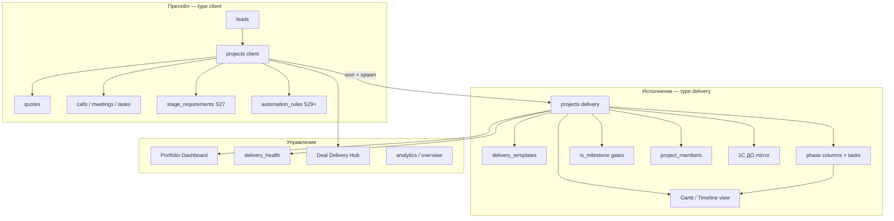

# Roadmap доработки CRM: Сделки и Проекты

**Дата:** 2026-07-13  
**Режим:** Аналитик кейсов (pm-consultant) + продуктовая стратегия  
**Основа:** код `dashboard-crm`, `delivery-process-DO.md`, `architecture-delivery-projects.md`, `hubspot-map-and-gap-v2.md`, бенчмарки Accelo/Monday/Productive/Pipedrive  
**Аудитория:** владелец продукта, РП, разработка (спринты Claude Code)

---

## Executive Summary

dashboard-crm уже прошла точку «CRM для сделок» и вошла в зону **quote-to-delivery platform** для ниши маркировки (1С:ERP, Честный Знак). Архитектурное решение — одна таблица `projects` с тремя типами (`client` / `delivery` / `internal`) — **правильное** для команды 5–15 человек: меньше дублирования, единая RLS, единая timeline.

Сейчас сильные стороны — **продажи** (воронка, гейты S27, rotting/next action, TodayView, AI Hub) и **зачаток delivery** (spawn из won, шаблоны 1С:ДО, фазовая доска, команда, milestone gates P3). Слабое звено — **управление исполнением**: нет временной оси (Gantt), зависимостей, delivery health, сквозного вида «сделка → все внедрения → статус плана», богатой автоматизации и управленческой аналитики по портфелю проектов.

**Главный вывод senior PM:** не копировать Accelo/Monday/HubSpot целиком. Строить **гибридную модель**:

- **Сделки** — activity-based selling (Pipedrive/Close) + жёсткие stage gates (уникально).
- **Внедрение** — mirror 1С:ДО (4 состояния + 4 фазы СДР) + lightweight planning layer в CRM (Gantt «на вскидку», зависимости, вехи) без замены документооборота.
- **Сквозной контур** — Deal Won → Spawn → Track → Complete → (опционально) Support tickets.

Оценка полной программы: **~12–16 спринтов** (6–9 месяцев при 1 спринт/2 недели), но **каждая фаза самостоятельно ценна** — можно останавливаться после P2 и уже получить Gantt + delivery health.

---

## 1. Входные данные

### 1.1 Бизнес-контекст

| Параметр | Значение |
|----------|----------|
| Домен | Продажа и внедрение решений маркировки (IIoT, ERP/1С) |
| Команда | Менеджер/Аккаунт · Внедренец · Монтажник (+ админ/руководство) |
| Система-запись delivery | **1С:Документооборот** — планы, папки, чек-листы, приёмки |
| CRM-роль | Видимость для продаж и руководства, лёгкое планирование, связь со сделкой, **не** замена ДО |
| Стек | Next.js 15 + TypeScript + Supabase + Netlify |
| Мультитенантность | organizations + memberships + RLS |

### 1.2 Методология (pm-consultant / frameworks.md)

Для внедрений маркировки рекомендуется **Hybrid**:

| Блок | Методология | Почему |
|------|-------------|--------|
| Пресейл (сделка) | Activity-based + stage gates | Требования эволюционируют до won; после won — фиксация |
| План запуска (СДР) | Waterfall-фазы + rolling wave | Шаблон из 1С:ДО известен на 80%+; детализация — по мере входа в фазу |
| Исполнение задач | Kanban внутри фазы | Поток работы внедренца, не спринты |
| Параллельные активности (§3 СДР) | Kanban + timeline overlay | «Регулярные мероприятия» идут параллельно основному плану |

**Антипаттерн, которого избегаем:** Franken-Scrum на внедрении (спринты + полное ТЗ из шаблона ДО) — команда не работает в спринтах, работает по фазам запуска.

---

## 2. AS-IS: текущее состояние (верифицировано по коду)

### 2.1 Объектная модель

```
projects.type
├── client      → /deals          Сделка (воронка IIoT/ERP, stage_id, gates, health)
├── delivery    → /projects       Внедрение (parent_deal_id, шаблон, фазы СДР)
└── internal    → /projects       Внутренний проект (канбан PCT-1, без воронки)
```

**Routing-контракт:** `projectHref()`, бэкстоп на `/deals/[id]` и `/projects/[id]` по типу.

### 2.2 Сделки (`type='client'`) — что работает

| Возможность | Реализация | Зрелость |
|-------------|------------|----------|
| Воронка | `PipelineBoard`, `StackedPipeline`, `DealProgressBar` | ✅ |
| Стадии по `stage_id` | S29.1, legacy `stage` выводится | 🟡 часть читателей на legacy |
| Stage gates S27 | `stage_requirements`, `check_stage_requirements`, UI `StageReadiness` | ➕ сильнее HubSpot |
| Deal health / rotting | `deal-health.ts`, `DealFocusPanel`, TodayView W1a | ➕ |
| Next action | `next_step`, `next_action_date`, InlineEdit | ✅ |
| Weighted forecast | `PipelineBoard` (budget × probability) | 🟡 без quota/team |
| Фильтры / saved views | ChipFilter, `use-saved-views` (localStorage) | 🟡 не server segments |
| Файлы, timeline | `ProjectFiles`, `EntityTimeline` + `ActivityComposer` | ✅ |
| Won → spawn delivery | `spawn_delivery_project` RPC, UI на won-сделке | ✅ |
| Автоматизация S29 | `stage_entered → create_task` | 🟡 одно правило |

**Ключевые файлы:** `ProjectsView.tsx`, `PipelineBoard.tsx`, `ProjectDetail.tsx`, `DealFocusPanel.tsx`, `use-projects.ts`.

### 2.3 Проекты внедрения (`type='delivery'`) — что работает

| Возможность | Реализация | Зрелость |
|-------------|------------|----------|
| 4 состояния | `DELIVERY_PHASE_ORDER`, `DeliveryPipelineBoard` | ✅ |
| Spawn из won | `spawn_delivery_project`, шаблоны launch/experiment | ✅ |
| Фазовая доска задач | `project_columns` category=`phase`, `ProjectBoard` phase mode | ✅ P2a |
| Статус задачи = badge (lane) | `DELIVERY_TASK_STATUS_*`, `TaskCard` cycle | ✅ |
| Команда 3 роли | `project_members`, `ProjectTeam` | ✅ P2b |
| Прогресс задач | `progress_done/total` | ✅ |
| Milestone gates | `is_milestone`, `check_delivery_completion`, `DeliveryCompletionModal` | ✅ P3 |
| Ссылка на ДО | `do_url`, `do_external_id` (поля есть) | 🟡 sync нет |
| ERP vs IIoT шаблоны | `delivery_templates`, direction + kind | ✅ |

**Ключевые файлы:** `DeliveryPipelineBoard.tsx`, `DeliveryCompletionModal.tsx`, `delivery-phases.ts`, `use-delivery-gate.ts`.

### 2.4 Сквозные пробелы (главные)

| Пробел | Влияние на бизнес | Сейчас |
|--------|-------------------|--------|
| **Нет Gantt / timeline view** | РП не видит перекрытия, критический путь, «на вскидку» загрузку | ❌ |
| **Нет зависимостей задач** | Сдвиг одной задачи не каскадируется; нарушен паттерн 1С:ДО | ❌ |
| **Нет дат start/end на задачах** | Gantt невозможен без миграции | 🟡 только `deadline` |
| **Нет delivery health** | Руководство не видит «красные» проекты до эскалации | ❌ |
| **Нет портфельного вида** | Сколько внедрений в execution, где просрочки по фазам | 🟡 только канбан 4 колонки |
| **Сделка не показывает дочерние delivery** | Продажник не видит судьбу won-сделки | 🟡 `parent_deal_id` есть, UI слабый |
| **Quotes / КП не в CRM** | Разрыв между пресейлом и суммой контракта | ❌ |
| **Workflow engine узкий** | Ручная рутина на переходах стадий | 🟡 S29 |
| **activities/Notes не в timeline** | Потерянные заметки vs HubSpot Notes | 🟡 |
| **1С:ДО sync** | Двойной ввод статуса | ❌ |
| **Legacy `projects.stage`** | Рассинхрон фильтров/CommandPalette | 🟡 техдолг |

---

## 3. Jobs-to-be-done по ролям

### 3.1 Менеджер продаж (сделка)

| JTBD | Сейчас | Цель |
|------|--------|------|
| Понять, что делать сегодня по сделкам | TodayView + DealFocusPanel | + приоритизация по сумме/вероятности |
| Провести сделку по воронке без «дыр» | Gates + completeness | + playbooks по стадии (чеклист действий) |
| Зафиксировать итог звонка/встречи | Calls/Meetings + AI Hub | + автозадачи из AI-результата |
| Понять, что случилось после won | Spawn delivery | + **Deal Delivery Hub**: все внедрения, статус, ссылка ДО |
| Отправить/отследить КП | Вне CRM (kp-master) | + объект `quotes` на сделке |

### 3.2 Руководитель проекта / внедренец (delivery)

| JTBD | Сейчас | Цель |
|------|--------|------|
| Развернуть план из шаблона | spawn + templates | + выбор задач «НЕ ТРЕБУЕТСЯ», кастомизация при spawn |
| Вести задачи по фазам СДР | Phase board | + **Gantt** (вскидка) + зависимости |
| Видеть просрочки и вехи | Milestone badge + completion gate | + **delivery health** + dashboard просрочек |
| Сдвинуть план при задержке | Вручную в ДО | + **cascade shift** (опционально, P3) |
| Закрыть проект формально | DeliveryCompletionModal | + sign-off workflow (чеклист как в xlsx ДО) |
| Работать в ДО, CRM — для обзора | do_url | + **status sync** из ДО (P4) |

### 3.3 Руководство / админ

| JTBD | Сейчас | Цель |
|------|--------|------|
| Портфель: сколько в какой фазе | DeliveryPipelineBoard | + **Portfolio Dashboard** (метрики, aging) |
| Forecast продаж | PipelineBoard weighted | + quota, win rate по направлению |
| Кто перегружен | ❌ | + загрузка по `project_members` (lite, без timesheet) |
| Аудит: почему сделка застряла | activity_log, timeline | + **stage aging report** |

---

## 4. Стратегические принципы (без компромиссов)

### 4.1 CRM зеркалит ДО, не заменяет

Тяжёлый документооборот (папки клиента, аттестации, чек-листы администратора) остаётся в 1С:ДО. CRM хранит:

- связь deal ↔ delivery;
- 4 состояния + прогресс задач;
- команду и ответственных;
- **лёгкий план** (даты, зависимости, Gantt) для координации;
- ссылку `do_url` и в перспективе `do_external_id` + `do_synced_at`.

### 4.2 Два ортогональных «этапа» — не смешивать

Уже зафиксировано в PCT-1 и delivery P2a:

1. **`stage_id`** — где проект/сделка в **воронке** (продажа или 4 состояния delivery).
2. **`project_columns` / `column_id`** — **фаза СДР** или статус исполнения задачи.

Любая новая фича (Gantt, зависимости, WBS) должна уважать это разделение.

### 4.3 Вертикаль > горизонталь

Приоритет фич, которые экономят часы на **каждом** запуске маркировки (шаблоны, milestone gates, фазовая доска), над generic PSA (time tracking, invoicing, client portal).

### 4.4 DB enforcement > UI prompts

Сохранять паттерн S27/P3: check-функция + BEFORE trigger + UI-чеклист. Accelo делает наоборот (UI required fields) — мы сильнее в compliance.

---

## 5. TO-BE: целевая архитектура



---

## 6. Функциональные блоки доработки

### Блок A. Сделки — углубление sales execution

#### A1. Deal Delivery Hub (сквозная карточка won)

**Проблема:** после won менеджер теряет контекст исполнения.

**Решение:** на `ProjectDetail` для `client` + секция на won-сделках:

- список `projects WHERE parent_deal_id = deal.id` (launch, experiment, ERP);
- по каждому: состояние, прогресс задач, delivery health, `do_url`;
- CTA «Создать внедрение» (уже есть) + «Открыть в ДО».

**Effort:** 0.3 спринта. **Приоритет:** P1.

#### A2. Quotes / КП как объект сделки

**Проблема:** сумма в `budget` не связана с жизненным циклом КП.

**Модель:**

```sql
quotes (
  id, org_id, project_id → projects(client),
  status: draft | sent | accepted | rejected | expired,
  amount bigint, currency, sent_at, accepted_at,
  document_url text,  -- ссылка на HTML/PDF из kp-master
  notes text
)
```

**UI:** вкладка «КП» на сделке; при `accepted` — предложить обновить `budget` + spawn delivery.

**Effort:** 0.5 спринта. **Приоритет:** P2.

#### A3. Playbooks по стадиям (не workflow engine)

**Проблема:** S29 создаёт одну задачу; нет «что делать на стадии Подготовка КП».

**Решение (лёгкое, до P1 workflow):** `stage_playbooks` — JSONB чеклист привязанный к `stage_id`:

- read-only чеклист в `DealFocusPanel` / `StageReadiness`;
- кнопка «Создать задачи из playbook» → batch insert tasks.

**Effort:** 0.4 спринта. **Приоритет:** P2.

#### A4. Убрать legacy `projects.stage`

**Проблема:** `ProjectsTable` track-фильтры, `ContactDetailHub`, `CommandPalette` читают enum.

**Решение:** миграция читателей на `stage_id` + `pipeline_stages`; deprecate enum в UI.

**Effort:** 0.5 спринта. **Приоритет:** P1 (техдолг, снижает баги).

#### A5. Server-side segments

Эволюция `use-saved-views`: таблица `segments` с JSONB predicate, пересчёт по cron или on-read.

Примеры: «Сделки без касания 21+ дн», «Бюджет > 1M без КП», «В стадии > 30 дн».

**Effort:** 0.5 спринта. **Приоритет:** P2.

---

### Блок B. Проекты внедрения — planning layer

#### B1. Даты start/end на задачах (фундамент Gantt)

**Миграция:**

```sql
ALTER TABLE tasks ADD COLUMN start_date date;
ALTER TABLE tasks ADD COLUMN duration_days int;  -- или end_date date
-- Инвариант: end >= start при наличии обоих
```

**UI:** в `TaskModal` / `TaskCard` — поля дат; при отсутствии — fallback на `deadline` как end.

**Effort:** 0.3 спринта. **Приоритет:** P1 (блокер для Gantt).

#### B2. Gantt / Timeline view («на вскидку»)

**Концепция senior PM:** не строить MS Project. Нужен **rough-cut Gantt** для совещаний РП:

- ось X: недели/месяцы;
- ось Y: задачи сгруппированы по фазе (`column_id` → phase);
- полосы: `start_date` … `end_date` (или deadline);
- milestone: ромб `is_milestone`;
- параллельная фаза «Регулярные» — отдельный swimlane или полупрозрачный слой;
- **read-only v1**, drag-to-resize — v2.

**Технология (рекомендация):**

| Вариант | Плюсы | Минусы |
|---------|-------|--------|
| `gantt-task-react` | Готовый Gantt, MIT | Зависимость, стилизация под 9 тем |
| Custom SVG + `recharts`/`visx` | Полный контроль темы | 1+ спринт на полировку |
| **Frappe Gantt** (fork) | Легковесный | Мало фич |

**Рекомендация:** `gantt-task-react` v1 за 0.7 спринта; переключатель «Доска | Gantt» на вкладке задач `ProjectDetail`.

**Effort:** 0.7–1 спринт. **Приоритет:** P1 (явный запрос).

#### B3. Зависимости задач (FS / SS lite)

**Модель:**

```sql
task_dependencies (
  id, org_id,
  predecessor_id → tasks,
  successor_id → tasks,
  type text CHECK (type IN ('FS'))  -- finish-to-start достаточно для v1
)
```

**Поведение v1:**

- валидация DAG (no cycles) в RPC или trigger;
- на Gantt — стрелки между полосами;
- **без** автоматического cascade shift (v2).

**Поведение v2 (P3):** при сдвиге predecessor end → предложить сдвиг successor (как в 1С:ДО «план пересчитывается»).

**Effort:** 0.5 спринта (v1), +0.5 (cascade). **Приоритет:** P2.

#### B4. WBS / иерархия задач

Шаблоны ДО уже несут `wbs_code` в тексте (`1.3.11 Отгрузка`). Правильная модель:

```sql
ALTER TABLE tasks ADD COLUMN parent_task_id uuid → tasks;
ALTER TABLE tasks ADD COLUMN wbs_code text;
```

**UI:** collapsible tree в фазе; на Gantt — группировка по parent.

**Effort:** 0.6 спринта. **Приоритет:** P2.

#### B5. Delivery Health Score

**Проблема:** `calculateDealHealth` только для sales; delivery слепой.

**Факторы (0–10):**

| Фактор | Вес | Логика |
|--------|-----|--------|
| Просроченные задачи | 3 | count(lane != done AND deadline < today) / total |
| Открытые milestones | 2 | из `check_delivery_completion` |
| Дней в состоянии | 2 | `stage_entered_at` > порога по фазе |
| Прогресс vs план | 2 | progress_done/total vs elapsed time |
| Последняя активность | 1 | max(timeline events) |

**UI:** `HealthDot` на `DeliveryPipelineBoard` карточках + в шапке `ProjectDetail`.

**Effort:** 0.4 спринта. **Приоритет:** P1.

#### B6. Portfolio Dashboard (раздел «Проекты»)

Над `DeliveryPipelineBoard` — сводка:

- count по 4 состояниям;
- top-5 «красных» по delivery health;
- просроченные milestones;
- aging: среднее дней в «Исполняется»;
- split IIoT / ERP.

**Effort:** 0.5 спринта. **Приоритет:** P2.

#### B7. Spawn UX: кастомизация шаблона

Сейчас spawn копирует все `default_enabled=true`. Нужно:

- превью задач шаблона с чекбоксами (как «НЕ ТРЕБУЕТСЯ» в ДО);
- выбор даты старта → сдвиг относительных дат задач.

**Effort:** 0.5 спринта. **Приоритет:** P2.

#### B8. Sign-off чеклисты (из xlsx ДО)

P3 закрыл milestone **задачи**. Следующий уровень — **структурированные чеклисты** приёмки:

```sql
project_checklists (
  id, org_id, project_id, checklist_type,  -- 'doc_review' | 'handover_support'
  items jsonb,  -- [{key, label, checked, checked_by, checked_at}]
  completed_at
)
```

UI: модалка перед `status → completed` дополняет milestone gate.

**Effort:** 0.6 спринта. **Приоритет:** P3.

---

### Блок C. Сквозной контур Deal → Delivery

#### C1. Автоматизация Won → задачи + уведомление

Расширить S29:

- trigger `status_changed` (client, → won);
- actions: `notify` (РП, внедренец), `create_task` («Создать проект внедрения»), опционально `create_activity`;
- **не** auto-spawn (РП выбирает launch/experiment — решение Олега P1).

**Effort:** часть P1 workflow (см. D1). **Приоритет:** P1.

#### C2. Единый идентификатор клиента на цепочке

На deal и delivery наследуются `company_id`, `contact_id`, `direction`. Добавить:

- бейдж «Цепочка: Сделка X → Внедрение Y» в timeline обеих карточек;
- фильтр в Portfolio: «все delivery по компании Z».

**Effort:** 0.2 спринта. **Приоритет:** P1.

---

### Блок D. Автоматизация (главный стратегический разрыв)

#### D1. Workflow Engine MVP (эволюция S29)

**Цель:** закрыть gap с HubSpot/Accelo без visual canvas.

| Компонент | MVP | Full |
|-----------|-----|------|
| Триггеры | `stage_entered`, `field_changed`, `status_changed`, `task_overdue` | `time_based`, `deadline_approaching` |
| Условия | JSONB predicate на entity | nested AND/OR |
| Действия | `create_task`, `set_field`, `notify`, `create_activity` | `webhook`, `spawn_delivery` |
| Задержки | `due_in_days` на задаче | `scheduled_jobs` + pg_cron |
| UI | Settings → Правила (таблица) | drag-drop builder |

**Таблицы:** уже есть `automation_rules`, `automation_runs` — расширить `trigger_type`, `conditions`, `action_config`.

**Effort:** 1.5–2 спринта. **Приоритет:** P1 (параллельно с Gantt).

#### D2. Progression UX на переходе стадии

При drag на `PipelineBoard` / клике `StackedPipeline` — модалка перехода (паттерн Accelo):

- список unmet gate requirements (уже есть);
- **+** playbook checklist;
- **+** optional comment в activity_log;
- **+** preview automation actions («Будет создана задача: …»).

**Effort:** 0.5 спринта. **Приоритет:** P2.

---

### Блок E. Timeline и коммуникации

#### E1. Notes в EntityTimeline

Подключить `activities.type='note'` к `use-entity-timeline` + composer (уже есть comment → activity_log; унифицировать).

**Effort:** 0.2 спринта. **Приоритет:** P1.

#### E2. Email / Telegram как activity (отложено)

Таблица `communications` — только после реального канала. Не блокер.

---

### Блок F. Аналитика

#### F1. Delivery analytics page

Новые виджеты на `/analytics` или подраздел:

- throughput: завершённые delivery / месяц;
- cycle time: initiated → completed (median);
- bottleneck phase: где больше всего aging;
- win → spawn lag: дней между won и spawn.

**Effort:** 0.5 спринта. **Приоритет:** P3.

#### F2. Sales analytics углубление

- conversion rate по стадиям (уже частично в Charts);
- forecast by month с historical win rate;
- reconnect correlation с lost deals.

**Effort:** 0.4 спринта. **Приоритет:** P3.

---

### Блок G. Интеграции

#### G1. 1С:ДО status sync (P4)

**Scope v1 (read-only):**

- webhook или scheduled poll по `do_external_id`;
- обновление `stage_id` / `status` delivery;
- `do_synced_at`;
- конфликт: CRM manual override flag.

**Не в scope:** двусторонний план задач, файлы, папки.

**Effort:** 1.5–2 спринта. **Приоритет:** P4.

#### G2. 1С:ERP / Шоурум — ссылка на заказ

Поле `showroom_order_url` на deal/delivery (из атрибутов ДО §3).

**Effort:** 0.1 спринта. **Приоритет:** P2.

---

### Блок H. Опционально (go/no-go)

| Фича | Когда нужна | Effort |
|------|-------------|--------|
| Support tickets на delivery | Вопросы клиента теряются после передачи | 1 спринт |
| Client portal (read-only статус) | Клиенты просят «личный кабинет» | 2 спринта |
| Resource loading / capacity | Команда > 15, конфликты внедренцев | 1 спринт |
| Baseline / EVM | Гос/крупный ERP с фикс-price | 2 спринта |

---

## 7. Модель данных — сводная дельта

| Объект | Назначение | Фаза |
|--------|------------|------|
| `tasks.start_date`, `end_date`/`duration_days` | Gantt | P1 |
| `task_dependencies` | FS-связи | P2 |
| `tasks.parent_task_id`, `wbs_code` | WBS-дерево | P2 |
| `quotes` | КП на сделке | P2 |
| `stage_playbooks` | Чеклисты стадий | P2 |
| `segments` | Server-side saved views | P2 |
| `project_checklists` | Sign-off ДО | P3 |
| `communications` | Email/TG | P5+ |
| `scheduled_automation_jobs` | Отложенные правила | P2 |
| `delivery_health` (computed/view) | Health score | P1 |

**Не добавлять:** отдельную таблицу `deals` — схлопывание в `projects` работает.

---

## 8. Roadmap по фазам

### P0 — Завершение текущего контура (если не на проде)

| Epic | Содержание | Effort |
|------|------------|--------|
| P3 milestone gate | Миграция 038, `DeliveryCompletionModal` | 1 спринт |
| Документация schema | docs/schema.md ↔ живая БД | 0.1 |

### P1 — «Видеть план» (6–8 недель)

**Цель:** РП открывает проект и видит фазы, Gantt-вскидку, health, связь со сделкой.

| # | Epic | Effort | Зависимости |
|---|------|--------|-------------|
| 1 | `start_date`/`end_date` на tasks | 0.3 | — |
| 2 | Gantt view на ProjectDetail | 0.7 | #1 |
| 3 | Delivery health score | 0.4 | — |
| 4 | Deal Delivery Hub на won-сделке | 0.3 | — |
| 5 | Notes в EntityTimeline | 0.2 | — |
| 6 | Legacy stage → stage_id migration | 0.5 | — |
| 7 | Workflow MVP (triggers + 3 actions) | 1.5 | — |
| 8 | Won → notify + task automation | 0.2 | #7 |

**Итого P1:** ~4 спринта.

**Demo P1:** открыть delivery «ОМК», переключить «Доска | Gantt», увидеть фазы и milestone-ромбы; на won-сделке — список внедрений с health; перетащить сделку — модалка gate + automation preview.

### P2 — «Управлять планом» (6–8 недель)

| # | Epic | Effort |
|---|------|--------|
| 1 | task_dependencies + стрелки на Gantt | 0.5 |
| 2 | WBS parent_task_id | 0.6 |
| 3 | Spawn preview + date shift | 0.5 |
| 4 | Portfolio Dashboard | 0.5 |
| 5 | quotes object | 0.5 |
| 6 | stage_playbooks | 0.4 |
| 7 | server segments | 0.5 |
| 8 | Progression modal UX | 0.5 |
| 9 | showroom_order_url | 0.1 |

**Итого P2:** ~4 спринта.

### P3 — «Закрывать качественно» (4–6 недель)

| # | Epic | Effort |
|---|------|--------|
| 1 | project_checklists (sign-off ДО) | 0.6 |
| 2 | cascade date shift | 0.5 |
| 3 | Delivery + Sales analytics | 0.9 |
| 4 | Gantt drag-resize | 0.4 |
| 5 | Workflow: time_based + webhook | 0.6 |

**Итого P3:** ~3 спринта.

### P4 — «Синхронизация с ДО» (4–6 недель)

| # | Epic | Effort |
|---|------|--------|
| 1 | DO read-only status sync | 1.5 |
| 2 | Conflict resolution UI | 0.5 |
| 3 | Sync health monitoring | 0.3 |

### P5 — Опционально

Tickets, client portal, capacity — по go/no-go из §6H.

---

## 9. Gantt — детальная спецификация (отдельный раздел)

### 9.1 Зачем (менторский ответ)

Kanban отвечает на «что сейчас в работе по фазе». Gantt отвечает на «**когда** это должно случиться и что параллельно». В 1С:ДО режим «Планирование» — именно это. Без Gantt CRM не закрывает JTBD руководителя проекта на планёрках.

### 9.2 Scope v1 (строго)

**Включено:**

- группировка по фазе СДР (4 swimlane);
- bar = task с датами;
- milestone = diamond (`is_milestone`);
- today line;
- zoom: week / month;
- tooltip: название, исполнитель, lane-статус;
- фильтр: только открытые / все / только milestones.

**Исключено v1:**

- drag-to-move (v2);
- critical path highlight (v2, нужны dependencies);
- resource histogram;
- baseline / planned vs actual;
- export PDF (v3).

### 9.3 Scope v2

- FS-зависимости со стрелками;
- critical path (longest path в DAG);
- drag bar → update `start_date`/`end_date` + optimistic mutation;
- «Регулярные мероприятия» — повторяющиеся полосы (optional).

### 9.4 UI-размещение

```
ProjectDetail (delivery)
├── Header (состояние, health, прогресс)
├── Pipeline strip (4 состояния)
├── Team | DO link | Parent deal
└── Tabs: [Активность] [Доска] [Гант]
```

Для `internal` — Gantt опционален (P3), приоритет ниже.

### 9.5 API

Хук `useProjectSchedule(projectId)`:

- join tasks + columns (phase) + dependencies;
- compute `end_date` = `end_date ?? deadline`;
- return `GanttTask[]` адаптированный под выбранную библиотеку.

---

## 10. Карта рисков

| Риск | Вероятность | Влияние | Митигация | Триггер |
|------|-------------|---------|-----------|---------|
| Gantt превращается в MS Project | Средняя | Высокое | Жёсткий scope v1 §9.2 | Разработка > 1 спринта на Gantt |
| Двойной ввод CRM vs ДО | Высокая | Высокое | mirror-принцип; sync P4; `do_url` prominent | РП жалуется на дублирование |
| Cascade shift ломает план | Средняя | Среднее | v2 opt-in «Предложить сдвиг» | Неверные даты после автосдвига |
| Workflow engine scope creep | Высокая | Высокое | MVP без canvas; JSON rules only | > 4 триггеров в MVP |
| legacy stage рассинхрон | Средняя | Среднее | P1 epic A4 | Баги фильтров после смены стадии |
| performance Gantt на 200+ задач | Низкая | Среднее | virtualize; load by phase | Лаг при открытии шаблона launch |
| ERP-процесс ≠ IIoT ДО | Средняя | Среднее | отдельные шаблоны direction=erp | РП ERP просит другую WBS |

---

## 11. Метрики успеха (KPI)

### 11.1 Adoption

| Метрика | Baseline | Target P1 | Target P2 |
|---------|----------|-----------|-----------|
| % delivery с заполненными датами задач | ~0% | 50% | 80% |
| % won-сделок со spawn < 7 дн | измерить | 80% | 90% |
| Открытий Gantt / неделя / РП | 0 | 3+ | 5+ |

### 11.2 Operational

| Метрика | Target |
|---------|--------|
| Median cycle time initiated → completed | −15% за квартал после P2 |
| Count delivery с health=red | видимость + снижение на 30% |
| Просроченные milestones без эскалации | 0 за 48h |

### 11.3 Sales

| Метрика | Target |
|---------|--------|
| % open deals с next_action_date | 95% (TodayView уже пушит) |
| Stage aging > 30d без activity | −20% |

---

## 12. Сознательно НЕ строим

| Возможность | Почему |
|-------------|--------|
| Полноценный PSA (time, billing, margin) | 1С + малая команда; Accelo = $69/user/mo оверхед |
| Замена 1С:ДО | Документооборот, аттестации, папки — не CRM |
| Visual workflow canvas v1 | Дорого; JSON rules достаточно |
| HubSpot Marketing / Sequences | Вне домена |
| Breeze-style автономные агенты | AI Hub = HITL доменные пресеты |
| Full MS Project (EVM, baseline) | Только если тендер ГОЗ требует |
| Отдельные объекты Deals и Projects в БД | Схлопывание — осознанная сила |

---

## 13. Backlog epics (готово к sprint prompt)

Каждый epic — кандидат в `SPRINT-*.md` для Claude Code. Рекомендуемый порядок:

1. **S-GANTT-1:** tasks dates + Gantt view (read-only)
2. **S-DLV-HEALTH-1:** delivery health score + board badges
3. **S-DEAL-HUB-1:** child deliveries на won-сделке
4. **S-LEGACY-STAGE-1:** миграция читателей на stage_id
5. **S-WF-2:** workflow engine MVP
6. **S-NOTES-TIMELINE-1:** activities → EntityTimeline
7. **S-DEPS-1:** task_dependencies + Gantt arrows
8. **S-WBS-1:** parent_task_id + tree UI
9. **S-QUOTE-1:** quotes table + deal tab
10. **S-PORTFOLIO-1:** delivery portfolio dashboard
11. **S-SPAWN-UX-2:** template preview + date shift
12. **S-CHECKLIST-1:** sign-off checklists ДО
13. **S-DO-SYNC-1:** read-only status from 1С

---

## 14. Рекомендации (итог senior PM)

1. **Начать с P1 без колебаний:** Gantt + delivery health + Deal Hub — максимальный скачок воспринимаемой ценности при умеренном риске.
2. **Параллельно закрыть техдолг legacy stage** — иначе каждая новая фича на сделках будет ломаться о два источника истины.
3. **Workflow MVP — не откладывать:** это главный структурный разрыв с рынком; Gantt без автоматизации «напомнить о просрочке» — половина ценности.
4. **Зависимости — сразу после Gantt:** иначе Gantt останется «картинкой» без причинно-следственной связи, как в Excel.
5. **1С sync — только read-only и только после того, как CRM-план стабилен** (P4). Иначе синхронизируете хаос.
6. **Не раздувать internal-проекты** — фокус на `client` + `delivery`; internal — таблица без Gantt до P3.

---

## 15. Связанные артефакты

| Документ | Роль |
|----------|------|
| `_analysis/delivery-process-DO.md` | Канон процесса 1С:ДО |
| `_analysis/architecture-delivery-projects.md` | D3-модель delivery |
| `_analysis/hubspot-map-and-gap-v2.md` | Gap sales/automation |
| `improvements/CRMs/accelo-analysis-2026-07-12.md` | PSA/delivery бенчмарк |
| `improvements/CRMs/monday-analysis-2026-07-12.md` | Phase board + Gantt паттерны |
| `concept-project-centric-tasks.md` | PCT-1 основание |
| `improvements/pm-consultant.skill` | Методология анализа |

---

*Документ подготовлен в режиме «Аналитик кейсов» pm-consultant: структура проекта, фазы, зависимости, риски, методология Hybrid. Для ценовой стратегии коммерческих предложений — скилл presale-pm. Для формального BPMN процесса ДО — bpa-analyst.*